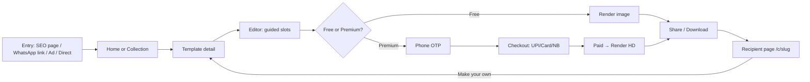

# 03 — UX and Conversion Design

**Status:** Draft v1 · **As of:** 2 October 2026 · **Owner:** Design + Product
Labels: **[V]** sourced · **[E]** estimate · **[A]** assumption.

---

## 1. Information architecture

### 1.1 Sitemap (MVP)

```
/{locale}                                   Home (festival-calendar driven)
├── /{locale}/festivals                     All festivals (calendar view)
│   └── /{locale}/festivals/{festival}      Festival collection (e.g. diwali, gudi-padwa, pongal)
├── /{locale}/wishes                        Wishes hub
│   └── /{locale}/wishes/{occasion}         Birthday, Anniversary, Congratulations, Thank you, Condolence
├── /{locale}/invitations                   Invitations hub
│   └── /{locale}/invitations/{event}       Wedding, Engagement, Haldi-Mehendi-Sangeet, Griha Pravesh,
│                                           Birthday party, Puja/Katha, Naming ceremony, Baby shower
├── /{locale}/t/{template-slug}             Template detail
├── /{locale}/create/{draft-id}             Editor (guided slots)
├── /{locale}/checkout/{order-id}           Checkout
├── /{locale}/done/{card-id}                Success + share
├── /{locale}/search?q=                     Search results
├── /{locale}/my                            My Cards (drafts, purchased, renders)
│   ├── /{locale}/my/orders                 Orders + invoices + refund status
│   └── /{locale}/my/events/{event-id}      Invitation host dashboard (RSVP)
├── /{locale}/wishes-text/{festival}        SEO content pages ("Diwali wishes in Marathi")
├── /c/{card-slug}                          Recipient card page (language = card's language)
├── /e/{event-slug}                         Recipient event page (invitations, RSVP)
└── /{locale}/help, /privacy, /terms, /refunds, /grievance
```

### 1.2 Primary navigation (mobile)
A bottom bar with 4 items: **Home · Festivals · Invitations · My Cards**. Search and the language switcher (अ / A / म / த) sit in the top bar.
A desktop top nav has the same items plus "Wishes".

### 1.3 Core flows



---

## 2. Screen-by-screen wireframes (MVP, mobile 360×800)

### 2.1 Home

```
┌──────────────────────────────────────┐
│ ☰  [Logo]          🔍   अ ▾  (lang)  │
├──────────────────────────────────────┤
│ ┌──────────────────────────────────┐ │
│ │  🪔  दिवाली — 5 दिन बाकी          │ │  ← Hero: next festival (real date)
│ │  [animated hero card preview]    │ │
│ │  अपनी फोटो और नाम के साथ भेजें      │ │
│ │  [ कार्ड बनाएं → ]                 │ │
│ └──────────────────────────────────┘ │
│ Diwali 5-day pack ₹79 (₹145 अलग से) │  ← Pack strip (truthful savings)
├──────────────────────────────────────┤
│ 🔥 इस दिवाली सबसे पसंदीदा          ⟶  │  ← "Most loved" rail (data rule)
│ [card][card][card]  (scroll)         │
│  BESTSELLER  FREE  ₹29  ₹19           │
├──────────────────────────────────────┤
│ 📅 आने वाले त्योहार                 ⟶  │  Bhai Dooj · Chhath · Guru Nanak Jayanti
├──────────────────────────────────────┤
│ 💌 निमंत्रण (Invitations)           ⟶  │  Wedding · Griha Pravesh · Birthday
├──────────────────────────────────────┤
│ 🎂 शुभकामनाएं (Wishes)             ⟶  │  Birthday · Anniversary
├──────────────────────────────────────┤
│ ✅ एक बार भुगतान • कोई ऑटो-पे नहीं      │  ← Trust strip
│ ✅ कार्ड फेल हुआ तो पैसा अपने-आप वापस  │
├──────────────────────────────────────┤
│  Home   Festivals   Invitations  My  │  ← Bottom nav
└──────────────────────────────────────┘
```

### 2.2 Collection / category (e.g. Gudi Padwa, Marathi)

```
┌──────────────────────────────────────┐
│ ←  गुढीपाडवा शुभेच्छा     🔍   म ▾    │
│ 7 एप्रिल • 12 दिवस बाकी               │
├──────────────────────────────────────┤
│ [Free] [Premium] [Video] [Status 9:16]│  ← Filter chips (sticky)
│ Sort: Popular ▾                       │
├──────────────────────────────────────┤
│ ┌────────┐ ┌────────┐                 │
│ │ ▶ video│ │ image  │   2-column grid │
│ │BESTSELL│ │  NEW   │   lazy-loaded   │
│ └────────┘ └────────┘   WebP posters  │
│  ₹29 ~~₹49~~  FREE                     │  ← Strike-through only if eligible
│  8,214 जणांनी पाठवले                    │  ← Real count (rounded down)
│ ┌────────┐ ┌────────┐                 │
│ ...                                   │
├──────────────────────────────────────┤
│ 📝 गुढीपाडवा शुभेच्छा संदेश (text)       │  ← SEO text wishes below the grid
└──────────────────────────────────────┘
```

### 2.3 Template detail

```
┌──────────────────────────────────────┐
│ ←                         ♡  ↗ share  │
│ ┌──────────────────────────────────┐ │
│ │                                  │ │
│ │   Large preview (video autoplay  │ │
│ │   muted, tap for sound)          │ │
│ │   [Your photo here] [Your name]  │ │  ← Slot hints on the preview
│ └──────────────────────────────────┘ │
│ BESTSELLER · Premium Video · 20 sec  │
│ ₹29  ~~₹49~~  41% off                 │
│ Festive price until 8 Nov, 11:59 PM  │  ← Real campaign end
│ ⭐ 4.6 (1,203 ratings) · 12,430 sent  │
├──────────────────────────────────────┤
│ Available in: हिन्दी • मराठी • English │  ← Variant switch
│ Formats: Status 9:16 • Square        │
├──────────────────────────────────────┤
│ What you get: HD 1080p • No watermark│
│ • 3 free edits in 7 days • Music     │
├──────────────────────────────────────┤
│ Also in the Diwali pack ₹79 →        │  ← Cross-sell
│ Similar cards  [card][card][card]    │
├──────────────────────────────────────┤
│ [  Personalise free preview →  ]     │  ← Primary CTA (try before buying)
└──────────────────────────────────────┘
```

### 2.4 Editor (guided slots)

```
┌──────────────────────────────────────┐
│ ✕  Personalise          Step 1 of 3  │
│ ┌──────────────────────────────────┐ │
│ │      LIVE PREVIEW                │ │  ← Updates ≤ 200 ms
│ │   (watermarked if premium)       │ │
│ └──────────────────────────────────┘ │
├──────────────────────────────────────┤
│ 📷 Your photo                         │
│ [ + Add photo ]  ☑ Remove background │
├──────────────────────────────────────┤
│ ✍️ From (name)                        │
│ [ Sunita Sharma & Family        ]    │
│  Suggestions: सुनीता शर्मा एवं परिवार   │  ← Transliteration chips
├──────────────────────────────────────┤
│ 💬 Message           [✨ Write for me]│  ← AI wish writer
│ [ आपको और आपके परिवार को...      ]    │
│ Tone: Traditional ▾  For: Family ▾   │
├──────────────────────────────────────┤
│ 🎵 Music: Diya Glow ▾ (video only)   │
│ Format: (•) Status 9:16 ( ) Square   │
├──────────────────────────────────────┤
│ [ Preview ]     [ Next → ]           │
└──────────────────────────────────────┘
```

Rules:
- Step 1: photo; step 2: names and message; step 3: style (music, format, colour). Invitations add an "Event details" step (date, time, venue + map pin, family names).
- Required slots are marked. "Next" stays disabled until they're valid, with an inline reason.
- Autosave every change (local storage; server when logged in).

### 2.5 Paywall step (premium only)

```
┌──────────────────────────────────────┐
│ Your card is ready!                   │
│ [ watermarked preview ]               │
├──────────────────────────────────────┤
│ ( ) Free version — small logo, 1080px │  ← Only for templates with a free tier
│ (•) HD, no watermark — ₹29 ~~₹49~~    │
│ ( ) Diwali 5-day pack — ₹79           │
│      5 cards incl. this one           │
├──────────────────────────────────────┤
│ 🔒 Pay once. No autopay.              │
│ ↩ Auto-refund if anything fails       │
│ [   Continue — ₹29   ]                │
└──────────────────────────────────────┘
```

### 2.6 Checkout

```
┌──────────────────────────────────────┐
│ ←  Checkout                           │
├──────────────────────────────────────┤
│ Diwali Glow (Video, HD)        ₹49    │
│ Festive discount              −₹20    │
│ WELCOME50 (auto-applied)      −₹14    │  ← Best coupon auto-applied
│ ─────────────────────────────────    │
│ To pay (incl. GST)             ₹15    │  ← Single, final number
├──────────────────────────────────────┤
│ 📱 Phone: +91 98•••••210 ✓ verified   │
├──────────────────────────────────────┤
│ Pay with UPI (recommended)            │
│ [GPay] [PhonePe] [Paytm] [Other UPI]  │  ← Intent buttons (mobile)
│ More: Cards • Net banking • Wallets   │
├──────────────────────────────────────┤
│ By paying you agree to Terms &        │
│ Refund policy. GST invoice by email.  │
│ [   Pay ₹15   ]                       │
└──────────────────────────────────────┘
```

Payment methods open in the gateway's hosted checkout or the UPI intent. On desktop, a UPI QR is shown first.

### 2.7 Success and share

```
┌──────────────────────────────────────┐
│ 🎉 Your card is ready!                │
│ ┌──────────────────────────────────┐ │
│ │       final HD card              │ │
│ └──────────────────────────────────┘ │
│ [ 🟢 Send on WhatsApp ]   ← primary  │
│ [ Status ]  [ Instagram ]  [ ⬇ Save ]│
│ [ 🔗 Copy link ]                      │
├──────────────────────────────────────┤
│ Make one for Bhai Dooj too? →         │  ← Next-festival cross-sell
│ Invite friends: you both get ₹20 →    │  ← Referral
│ Rate this card ☆☆☆☆☆                  │  ← Feeds ratings (real)
└──────────────────────────────────────┘
```

### 2.8 Recipient page (`/c/{slug}`)

```
┌──────────────────────────────────────┐
│  (no header nav, minimal brand mark)  │
│ ┌──────────────────────────────────┐ │
│ │   CARD (image or video, autoplay │ │
│ │   muted → 🔊 tap for sound)      │ │
│ └──────────────────────────────────┘ │
│ From: Sunita Sharma & Family          │
│ [ 💬 Send wishes back ]               │
├──────────────────────────────────────┤
│ ✨ Make your own Diwali card — free    │  ← Viral CTA (same template)
│    with your photo & name, in 1 min  │
│ [ Make my card → ]                    │
├──────────────────────────────────────┤
│ More Diwali cards [card][card][card]  │
│ Report this card                      │
└──────────────────────────────────────┘
```

Performance budget: ≤ 70KB JS, poster image ≤ 60KB, video streams progressively. **No ads, no login, no cookie wall** (only essential cookies before consent).

### 2.9 Event page and RSVP (`/e/{slug}`)

```
┌──────────────────────────────────────┐
│ [Video invite autoplay muted]        │
│ प्रिया ❤ राहुल                        │
│ 14 Feb 2027 • 7:00 PM                │
│ 📍 Shubh Mangal Karyalay, Pune [Map] │
│ [ 📅 Add to calendar ]                │
│ Language: मराठी | English             │
├──────────────────────────────────────┤
│ Will you attend?                      │
│ (•) Yes  ( ) Maybe  ( ) No            │
│ Guests: [ 2 ▾ ]  Name: [__________]   │
│ Message for the couple: [________]    │
│ [ Send RSVP ]                         │
├──────────────────────────────────────┤
│ Make your own invitation →            │
└──────────────────────────────────────┘
```

### 2.10 My Cards

```
┌──────────────────────────────────────┐
│ My Cards         [Drafts|Purchased|  │
│                   Events]             │
│ [card] Diwali Glow • Paid • 2 edits  │
│        left (till 15 Nov) [Edit][⬇]  │
│ [card] Priya & Rahul • Event • 86 RSVP│
│        [Dashboard] [Edit] [Share]     │
│ [card] Draft: Bhai Dooj • [Continue]  │
├──────────────────────────────────────┤
│ Orders & invoices →                   │
│ Order #A12 • ₹49 • Refunded ✓ (1 Nov) │
└──────────────────────────────────────┘
```

---

## 3. Conversion playbook (truthful by design)

Every persuasive element below has a **data rule** stored in configuration and an **audit trail**. A badge or number that can't be computed from real data **doesn't render**.

| # | Tactic | Where | Trigger rule | Data source (truth) | Expected impact | A/B test |
|---|---|---|---|---|---|---|
| 1 | **Strike-through price + % off** | Grid, detail, paywall, checkout | Show only if the reference price was the actual selling price on ≥ 30 of the last 90 days; % off = (ref − current) / ref, rounded **down** | `price_history` | +10–25% paid conversion **[E]** | Strike-through vs. plain price (only where eligible) |
| 2 | **Bestseller** badge | Grid, detail | Top 10% of templates by **paid orders in the last 7 days**, within the same collection and language; minimum 25 orders | `template_metrics_daily` | +5–15% CTR on badged items **[E]** | Badge on/off |
| 3 | **Trending in {state}** | Grid (geo-aware) | Week-on-week growth ≥ 50% in shares from that state and ≥ 100 shares | `template_metrics_daily` by state | +5% CTR **[E]** | vs. "Trending" (national) |
| 4 | **New** | Grid | Published in the last 14 days | `templates.published_at` | Freshness, return visits | — |
| 5 | **"12,430 people sent this"** | Detail, grid | Lifetime share count, **rounded down** to a meaningful figure (e.g. 12,400+); shown only if ≥ 100 | `shares` aggregate | +3–8% conversion **[E]** | Count vs. no count |
| 6 | **Ratings ⭐** | Detail | Only from users who **completed** that template; shown only with ≥ 20 ratings; no review gating | `ratings` | Trust for the 45+ audience | — |
| 7 | **Festival countdown** | Home hero, collection header | Counts to the **festival date** in `festivals` for the user's region | `festival_dates` | Urgency that is real | Countdown vs. static date |
| 8 | **Festive price ends …** | Detail, paywall | Only if a campaign with a logged `ends_at` exists; when it ends, the price really changes | `campaigns` | +10% conversion near the end **[E]** | Show end time vs. not |
| 9 | **Free preview, pay to remove watermark** | Editor → paywall | All premium templates | — | The core conversion engine (Desievite/WishNWed pattern **[V]**) | Watermark style (corner vs. diagonal light) |
| 10 | **Festival packs/bundles** | Home strip, paywall, cross-sell | Savings = Σ individual current prices − pack price | `prices` | +15% AOV **[E]** | Pack offered at paywall vs. after purchase |
| 11 | **First-purchase offer** | Paywall, checkout (auto-applied) | First paid order per verified phone | `orders` | +20–30% first conversion **[E]** | 50% off (≤ ₹50) vs. flat ₹10 off |
| 12 | **Decoy/anchor tier for invitations** | Invitation tier picker | Essential ₹149 / **Premium ₹399 (Most popular)** / Royal ₹799; "Most popular" only if it really is (≥ 40% of tier sales over the last 30 days; editorial label "Recommended" until then) | `orders` by tier | Shifts mix to the middle tier **[E]** | 3 tiers vs. 2 tiers |
| 13 | **Unlock by sharing** | Paywall (greetings only) | 3 verified share actions in the current festival window → 1 premium image unlock | `shares` | Virality + conversion to the habit | On/off by cohort |
| 14 | **Next-festival cross-sell** | Success page | The next festival within 14 days in the user's region | `festival_dates` | Repeat purchase | — |
| 15 | **Cart/checkout recovery** | WhatsApp/SMS/email | Only with **opt-in consent**; 1 reminder 30–60 min after an abandoned checkout; 1 more before the festival; never more than 2 | `orders` (state = CREATED, PAYMENT_FAILED) | Recovers 5–10% of abandoned checkouts **[E]** | Reminder at 30 vs. 120 min |
| 16 | **Trust strip** | Home, paywall, checkout | Always | Policy | Especially lifts conversion with 45+ users **[A]** | Trust strip vs. none |
| 17 | **Social proof on the recipient page** | `/c/` | "Made in 1 minute on [brand]" + "Make your own" | — | Recipient → creator | CTA copy variants |

### 3.1 Badge and count computation (engineering contract)
- Nightly job (and hourly during festival windows) → `template_metrics_daily(template_id, locale, state, date, views, editor_starts, completions, shares, orders, revenue)`.
- Badge eligibility is materialised into `template_badges(template_id, locale, badge, valid_from, valid_to, rule_version, evidence_json)`. The UI reads **only** this table.
- `evidence_json` stores the numbers that justified the badge (for regulatory audit and support queries).

---

## 4. Dark-pattern compliance mapping (CCPA Guidelines, 2023)

The CCPA lists 13 prohibited dark patterns **[V]**. This is how our UX avoids each one:

| Dark pattern (CCPA) | Risk in our product | Our guardrail |
|---|---|---|
| False urgency | Countdown timers, "only today" | Timers only for real festival dates or logged campaign end times; prices really change at the end |
| Basket sneaking | Pre-added add-ons (second language, packs) | Nothing pre-selected; add-ons are opt-in toggles with their price shown |
| Confirm shaming | "No thanks, I don't love my family" | Neutral decline copy ("Continue with free version") |
| Forced action | Forcing login or sharing to proceed | Free cards need no account; share-to-unlock is optional; phone is only required at payment |
| Subscription trap | Hard-to-cancel autopay (a known complaint against competitors **[V]**) | MVP has no subscriptions. In V1, the Pass uses opt-in autopay, a pre-debit notice, one-tap cancel in My Account, and a renewal reminder 3 days before |
| Interface interference | Hiding the free option; a greyed-out "decline" | The free option is visible wherever it exists; equal visual weight for the decline action |
| Bait and switch | Advertising ₹19, then charging ₹49 | The price from the grid carries through to checkout; any difference is explained before payment |
| Drip pricing | Fees revealed at the last step | GST-inclusive prices everywhere; no convenience fees |
| Disguised advertisements | Sponsored templates looking organic | No ads in the MVP; any future sponsorship is labelled "Sponsored" |
| Nagging | Repeated pop-ups and notifications | Frequency caps (§3, tactic 15); at most 1 modal per session |
| Trick wording | Ambiguous consent checkboxes | Plain-language consent, separate for marketing and analytics, unticked by default |
| SaaS billing | Silent renewals or charges | No hidden recurring billing; every charge is notified |
| Rogue malware | — | No third-party ad SDKs; strict CSP; supply-chain controls (`07-security-and-compliance.md`) |

**Process:** a quarterly **dark-pattern self-audit**, run against this table and recorded in the compliance log. Every new persuasive element needs a PM and legal sign-off ticket.

---

## 5. Mobile-first and performance UX

| Area | Requirement |
|---|---|
| Device target | Mid/low-end Android (4GB RAM, Snapdragon 6-series / Helio G), Chrome + WhatsApp in-app browser |
| Network | Works on a 1.5 Mbps effective connection; "Data saver" mode when `navigator.connection.saveData` is on or the network is slow (2g/3g) |
| Budgets | Home: JS ≤ 150KB gz, LCP ≤ 2.5s p75; recipient page: JS ≤ 70KB, LCP ≤ 1.5s p75 |
| Media | Grid posters as AVIF/WebP ≤ 25KB; video previews start as a poster, play on tap (or autoplay muted when in view on fast networks); HLS/short MP4 for previews |
| Perceived speed | Skeleton screens; optimistic UI for slot edits; progressive image loading (blur-up) |
| Uploads | Compress on the device (≤ 1.5MB, longest side 1600px), resumable upload, background retry |
| Offline | The PWA caches the shell + recent drafts; "You're offline — your draft is saved" |
| Input | Big tap targets (≥ 48px); numeric keypads for dates/phone; no captcha unless risk is high (Turnstile, invisible) |
| Data saver | Static posters instead of video previews, lower-resolution grids, no autoplay |

---

## 6. Accessibility (WCAG 2.1 AA)
- Colour contrast ≥ 4.5:1 for text (festive themes are checked against this; gold-on-saffron is a common failure).
- Every interactive element is reachable by keyboard, has a visible focus ring, and has localised ARIA labels.
- Videos: captions not needed for music-only cards. Invitation videos get a **text equivalent** on the event page (all details as text).
- Alt text for template previews, in the UI language.
- Base font size 16px+, with larger defaults for Devanagari and Tamil (Indic scripts need ~10–15% more size for legibility **[E]**). Supports OS font scaling to 200%.
- Motion: respect `prefers-reduced-motion` (no auto-animating hero).
- Error messages are in text, not colour alone.

---

## 7. Design system basics
- **Tokens:** colour, type, spacing, radius, elevation as CSS variables, with a **festival theme layer** (Diwali: deep maroon + gold; Holi: multi-colour on white; Pongal: green + turmeric yellow; Gudi Padwa: saffron + green; Eid: emerald + ivory; Christmas: red + pine). Themes change accents only; base surfaces keep contrast.
- **Typography scale per script:**
  - Latin: Inter/Mukta.
  - Devanagari: Mukta/Hind (UI), Tiro Devanagari (display).
  - Tamil: Mukta Malar/Catamaran (UI).
  - Line height 1.5 for Indic scripts (matras need room).
- **Components:** TemplateCard (badge slot, price block, language chips), PriceBlock (current, reference, % off, eligibility-driven), SlotInput (text with transliteration chips, photo, date/venue), Paywall, TrustStrip, Countdown, ShareBar, RSVPForm, EmptyState, Toast, Skeleton.
- **Iconography:** simple line icons plus a festival illustration set (commissioned, consistent style).
- **Voice:** warm, respectful, short. Hindi/Marathi use *aap*/*tumhi*, Tamil uses *neenga*. No guilt or fear language.

---

## 8. Key decisions (UX)
- **"Free preview, then pay"** is the core conversion mechanic, with a watermarked preview and an HD unlock.
- **Every persuasive element is driven by data and audited**; it renders nothing if the data doesn't support it.
- **The recipient page is a first-class product surface**, with a strict performance budget and no ads.
- **Invitations use a 3-tier price ladder** with an honest "Most popular" label.
- **Festival theming** is a token layer, not separate designs.

## 9. Open questions for the founder
1. Watermark style: a small corner logo (brand marketing) or a light diagonal (stronger push to pay)? Recommended: a corner logo for free cards and a diagonal for premium previews.
2. Should free cards show "Made with [brand]" text on the image itself? It helps virality but may annoy users. We'll A/B test it.
3. Ratings on templates from day 1, or after we have enough volume? Recommended: collect from day 1; display once there are ≥ 20.
