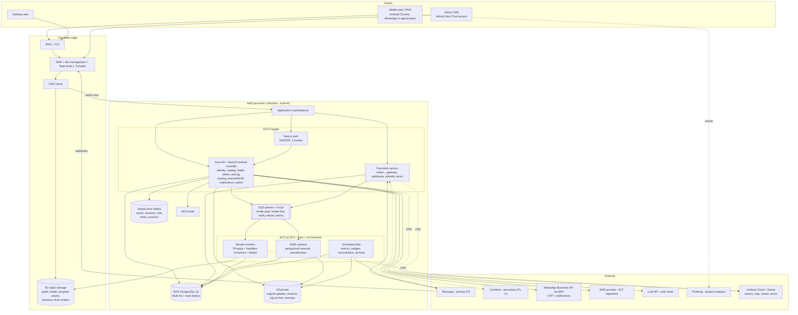
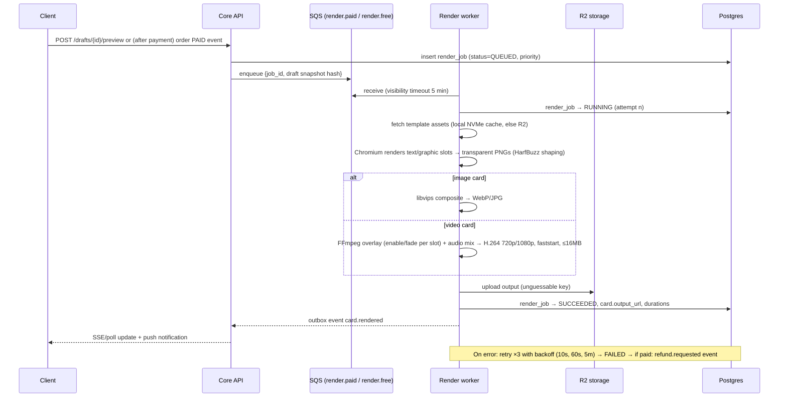
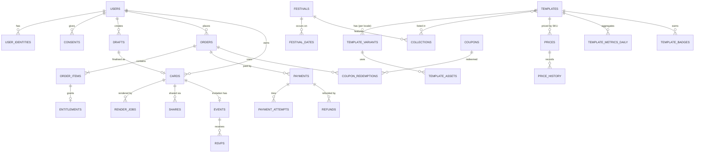

# 04 — System Design and Architecture

**Status:** Draft v1 · **As of:** 2 October 2026 · **Owner:** Engineering
Labels: **[V]** sourced · **[E]** estimate · **[A]** assumption.

**Design stance:** a small team (2–3 engineers) must be able to build and run this, and it must survive **Diwali-day spikes of 20–50x** without a rewrite. The architecture is a **modular monolith plus separately scaled render workers**, built on managed AWS services in Mumbai, with Cloudflare at the edge.

---

## 1. Non-functional requirements

| Category | Requirement | Number |
|---|---|---|
| Scale (year 1) | Peak MAU (Diwali 2027) | 1M **[A]**; designed for 5M without re-architecture |
| Scale | DAU, normal day / festival day | 30k / 600k **[A]** (20x) |
| Throughput | Peak API RPS (origin) | Design for **2,000 RPS** (expected peak ~1,100 **[E]**: 600k DAU × 15 API calls × 15% in the peak hour ÷ 3,600s × 3 burst factor) |
| Throughput | Peak edge RPS (CDN) | 20k RPS (static, media, cached HTML) |
| Throughput | Render jobs at peak | Design for **1,500 image/min + 300 video/min** (expected ~600 + ~150 **[E]**) |
| Latency (p95) | Catalog/API reads | ≤ 200ms origin; ≤ 50ms when cached at the edge |
| Latency (p95) | Create order / payment | ≤ 500ms (excluding gateway UI) |
| Latency (p95) | Image render / video render | ≤ 5s / ≤ 60s (≤ 90s on a festival day) |
| Latency (p75) | LCP: home / recipient page on mobile 4G | ≤ 2.5s / ≤ 1.5s |
| Availability | Browse, editor, recipient pages | 99.9% monthly |
| Availability | Checkout, webhooks, refunds | 99.95% monthly; **zero planned downtime in festival windows** |
| Durability | Paid renders, orders, payments | 11 nines (object storage); PITR on the database |
| Recovery | RPO / RTO (within region) | RPO ≤ 5 min / RTO ≤ 1 h |
| Recovery | Regional disaster | RTO ≤ 8 h to Hyderabad (ap-south-2) from cross-region backups **[A]** |
| Cost | Infra as % of revenue at scale | ≤ 10%; video render ≤ ₹0.50 each; image ≤ ₹0.05 each **[E]** |
| Data residency | Payment-related data | Stored in India (AWS Mumbai), following RBI's localisation expectation for payment system data |

---

## 2. High-level architecture



**Request paths**
- **Browse/SEO pages:** Cloudflare CDN → (miss) Next.js ISR → catalog API → read replica / Redis.
- **Editor:** client-side live preview; uploads go **directly to S3 through presigned URLs** (the API never streams files).
- **Render:** API enqueues to SQS (paid and free queues are separate) → a render worker composes the card → uploads to R2 → updates Postgres → notifies the client (SSE/polling + push).
- **Payment:** API → Payments service creates a gateway order → the user pays in hosted checkout → a **webhook** (verified) moves the order to PAID → the paid render is enqueued.

---

## 3. Technology choices (with reasons)

| Layer | Choice | Why this fits | Rejected alternatives |
|---|---|---|---|
| Web frontend | **Next.js (App Router) + React + TypeScript**, Tailwind, `next-intl`, PWA via Serwist/Workbox | SSR/ISR for SEO in 4 languages; streaming for fast LCP; huge hiring pool in India; one language (TS) across the stack | SPA (poor SEO); Flutter Web (heavy bundles, weak SEO); Remix (smaller ecosystem) |
| Web hosting | Next.js standalone containers on **ECS Fargate** behind Cloudflare | Predictable cost at video-heavy scale; same region as data; no per-GB platform bandwidth fees | Vercel (excellent DX, but bandwidth and function costs climb at festival peaks; fine for prototyping) |
| Backend API | **NestJS (Node.js 22 LTS, TypeScript) as a modular monolith** | Strong module boundaries, DI, validation; same language as the frontend; good for I/O-bound APIs; easy to split later | Microservices on day 1 (ops overhead for 3 engineers); Go (fast, but a second language); Django (second language) |
| Primary DB | **PostgreSQL 16 on Amazon RDS**, Multi-AZ + 1 read replica; PgBouncer/RDS Proxy | ACID for orders/payments/refunds; JSONB for template slot schemas; partitioning for logs; mature tooling | MongoDB (weak multi-document transactions for money flows); DynamoDB (hard ad-hoc queries); Aurora (more cost at small scale; a clear upgrade path later) |
| Cache / counters / rate limits | **ElastiCache (Valkey/Redis)** | Sessions, hot catalog cache, token-bucket rate limits, real-time counters on festival day | Memcached (no data structures) |
| Queue | **Amazon SQS** (standard queues + DLQs) + **transactional outbox** in Postgres | Fully managed, scales to festival spikes, no ops; outbox guarantees "DB write + event" consistency | Kafka/MSK (overkill now); RabbitMQ (self-managed) |
| Object storage | **Cloudflare R2** for public media (template assets, previews, final renders); **S3** for private originals, invoices, backups, log archive | Media egress is the biggest variable cost; **R2 has zero egress fees** and sits behind Cloudflare's Indian PoPs. Private and sensitive data stays in S3 Mumbai | S3 + CloudFront only (simpler, but egress at ~$0.11/GB for India becomes a major line item at scale **[E]**) |
| CDN / WAF / bot defence | **Cloudflare** (Pro → Business plan) | Many Indian PoPs, WAF managed rules, bot management, Turnstile, rate limiting, DDoS protection included | CloudFront + AWS WAF (good, but more assembly and higher egress) |
| Render pipeline | **FFmpeg 7 (libx264, AAC)** for video composition; **headless Chromium (Playwright)** to render text/graphic layers as transparent PNGs; **libvips (sharp)** for image cards | Chromium uses HarfBuzz, so Devanagari/Tamil shaping is **identical to the browser preview**. FFmpeg compositing over pre-rendered backgrounds is cheap on CPU (~0.3–0.6x real time at 720p **[E]**) | Remotion (React video: great authoring, but heavier per-frame rendering and a company licence fee; consider for V1 premium motion templates); cloud video APIs like Shotstack/Creatomate (per-minute pricing too high at scale; possible burst fallback); GPU encoding (not needed for 720p compositing) |
| Render compute | **ECS on EC2** capacity providers: **Spot (c7g/c7i) + on-demand base**, scaled on SQS queue depth | Cheap and elastic; on-demand base keeps paid renders safe if Spot is reclaimed | Lambda (15-min/10GB limits, cold starts, Chromium size); Kubernetes (ops overhead) |
| Search | **MVP:** PostgreSQL `pg_trgm` + `unaccent` + an **alias table** (transliterations, synonyms). **V1:** Typesense | Small catalogue (< 5k templates) is fine in Postgres; aliases solve Hinglish | Elasticsearch/OpenSearch (ops heavy); Algolia (cost at scale) |
| AI: wish writer | Hosted LLM API (e.g. **Claude Haiku 4.5**, a fast, low-cost model) with prompt templates per language/festival/relation/tone, output moderation, caching of common combinations | Good multilingual quality; cost per wish is a fraction of a rupee **[E]**; no ML ops | Self-hosted open models (GPU ops burden for a small team) |
| AI: transliteration | **IndicXlit (AI4Bharat, open source)**, self-hosted on CPU | Free, accurate for Indic names, no per-call fees | Google Input Tools (no official API) |
| AI: background removal | Open-source segmentation model (e.g. BiRefNet/rembg class) on CPU workers; GPU Spot if volume grows | Cost control; predictable | Paid APIs (₹1–₹5 per image **[E]**; too expensive at free-tier volume) |
| Auth | In-house in NestJS: **phone OTP** (WhatsApp authentication template first, SMS fallback), Google OAuth; short-lived access JWT (15 min) + rotating refresh token (httpOnly, Secure, SameSite=Lax cookies) | Full control of the OTP cost and anti-abuse logic | Firebase Auth (phone OTP pricing, less control over abuse); Auth0 (cost) |
| Payments | **Razorpay** primary; **Cashfree** secondary (V1) | See `05-payments-and-refunds.md` | — |
| Email / notifications | **Amazon SES** (Mumbai); WhatsApp via a BSP (Gupshup/Interakt/Meta Cloud API); SMS via a DLT-registered provider (MSG91/Gupshup); Web Push (VAPID) | Low cost; Indian delivery | — |
| Product analytics | **PostHog Cloud** (events, funnels, cohorts, feature flags, experiments), plus server-side events | One tool for analytics + flags + A/B; free tier covers the MVP | GA4 alone (weak product funnels); Mixpanel (cost at scale; no flags) |
| Warehouse | **S3 (Parquet) + Athena** for the MVP; **BigQuery (asia-south1)** or ClickHouse in V1 | Cheap; joins product events with orders | A warehouse on day 1 (premature) |
| Observability | **OpenTelemetry** → **Grafana Cloud** (Prometheus metrics, Loki logs, Tempo traces, alerting) + **Sentry** (FE/BE errors) | Vendor-neutral instrumentation; strong alerting | Datadog (excellent but expensive at scale) |
| IaC / CI/CD | **Terraform** (AWS + Cloudflare providers); **GitHub Actions** → ECR → ECS blue/green (CodeDeploy) | Reproducible environments: dev, staging, prod | Click-ops |
| Admin | Next.js admin app (same monorepo) behind **Cloudflare Access** (SSO + device posture) + RBAC | Admin is never exposed to the open internet | A public admin URL |

**Repository layout (monorepo, pnpm + Turborepo):**
```
apps/web        Next.js public site (4 locales)
apps/admin      Next.js admin CMS
apps/api        NestJS core API (modules below)
apps/payments   NestJS payments service (separate deploy, same codebase conventions)
apps/render     Render worker (Node + FFmpeg + Chromium)
apps/jobs       Scheduled jobs (metrics, badges, recon, archival)
packages/templates   Template scene schema, validators, shared render logic
packages/i18n        Message catalogues, glossary
packages/ui          Design system components + festival themes
infra/terraform      Environments
```

---

## 4. Services and modules

**Why a modular monolith:** 2–3 engineers, one deployable for most domain logic, strict module boundaries (one Postgres schema per module, no cross-module table access, communication through module interfaces or outbox events). **Separate deployables on day 1 only where the scaling or risk profile differs:** render workers (CPU heavy, bursty) and payments (security isolation, independent deploys, stricter access).

| Module / service | Responsibilities | Key APIs | Owns data |
|---|---|---|---|
| **Identity** | OTP send/verify, Google login, sessions, devices, consent records, account deletion | `/auth/*`, `/me` | `users`, `user_identities`, `sessions`, `consents` |
| **Catalog** | Templates, variants, collections, categories, search, badges (read) | `/collections`, `/templates`, `/search` | `templates`, `template_variants`, `template_assets`, `collections`, `search_aliases`, `template_badges` |
| **Festival calendar** | Festival definitions, dates per year/region, the home page "next festival" | `/festivals` | `festivals`, `festival_dates` |
| **Drafts & editor** | Draft lifecycle, slot validation, previews | `/drafts` | `drafts` |
| **Media** | Presigned uploads, virus/MIME checks, EXIF stripping, background-removal jobs | `/uploads` | `media_objects` |
| **Render orchestration** | Enqueue renders, priority, status, retries, result registration | `/drafts/{id}/preview`, `/cards/{id}/render` | `cards`, `render_jobs` |
| **Pricing & promotions** | Prices, price history, campaigns, coupons, referral credits, discount-eligibility rule | internal + admin | `prices`, `price_history`, `campaigns`, `coupons`, `coupon_redemptions`, `credits` |
| **Orders** | Order creation, totals (GST-inclusive), state machine, entitlements (HD unlock, edit windows) | `/orders` | `orders`, `order_items`, `entitlements` |
| **Payments (service)** | Gateway orders, webhook ingestion, payment attempts, refunds, reconciliation, gateway routing (V1) | `/orders/{id}/payments`, `/webhooks/*` | `payments`, `payment_attempts`, `refunds`, `webhook_logs`, `payment_event_logs`, `settlements`, `recon_mismatches` |
| **Sharing & recipient** | Card links, share events, recipient page data, reports, privacy toggle | `/cards/{slug}`, `/cards/{id}/shares` | `shares`, `card_views` (sampled), `abuse_reports` |
| **Events & RSVP** | Event pages, RSVPs, host dashboard, CSV export | `/events/{slug}`, `/events/{slug}/rsvps` | `events`, `rsvps` |
| **Notifications** | WhatsApp/SMS/email/push sending, templates per locale, frequency caps, opt-ins | internal | `notifications`, `notification_prefs` |
| **AI** | Wish writer, moderation, transliteration proxy | `/ai/wishes`, `/ai/transliterate` | `ai_requests` (metadata only) |
| **Admin/CMS** | Template upload/publish, pricing, campaigns, refunds (maker-checker), moderation, RBAC | `/admin/*` | `admin_users`, `audit_logs` |
| **Metrics & badges (jobs)** | Daily/hourly aggregates, badge materialisation, template ROI | — | `template_metrics_daily` |
| **Alerting** | Critical business alerts → email (+ Slack/PagerDuty) with dedup | internal | `alert_events` |

---

## 5. Template model and render pipeline

### 5.1 Template scene schema (stored as JSONB in `template_variants.scene`)

```json
{
  "schema_version": 1,
  "kind": "video",
  "canvas": { "w": 1080, "h": 1920, "fps": 30, "duration_ms": 20000 },
  "formats": ["9x16", "1x1"],
  "background": { "asset": "r2://tmpl/diwali-glow/bg_9x16.mp4" },
  "audio": { "default_track": "trk_diya_glow", "choices": ["trk_diya_glow", "trk_shehnai_soft", "trk_none"] },
  "slots": [
    { "id": "photo", "type": "image", "required": false, "frame": { "x": 290, "y": 520, "w": 500, "h": 500, "mask": "circle" },
      "bg_removal": "optional", "enter": { "at_ms": 1500, "anim": "fade_scale", "dur_ms": 600 } },
    { "id": "from_name", "type": "text", "required": true, "script_hint": "auto",
      "box": { "x": 120, "y": 1180, "w": 840, "h": 160 }, "font_role": "display",
      "size": { "max": 84, "min": 48 }, "max_lines": 2,
      "limits": { "hi": 40, "mr": 40, "ta": 36, "en": 48 },
      "enter": { "at_ms": 2200, "anim": "slide_up", "dur_ms": 500 } },
    { "id": "message", "type": "text", "required": false, "box": { "x": 120, "y": 1380, "w": 840, "h": 300 },
      "font_role": "body", "size": { "max": 48, "min": 32 }, "max_lines": 4,
      "limits": { "hi": 140, "mr": 140, "ta": 120, "en": 160 } }
  ],
  "fonts": { "display": "TiroDevanagariMarathi-Regular", "body": "Mukta-Medium" },
  "theme": { "text_color": "#FFE7A3", "shadow": "0 2px 6px rgba(0,0,0,.45)" },
  "watermark": { "free": "corner_logo", "preview": "diagonal_light" }
}
```

### 5.2 Render flow



**Determinism and caching:** the render key = hash(template_variant_version + slot values + format + quality). A matching key reuses the existing output (no re-render), which saves cost when users tap "render" twice.

**Pre-rendering:** for the top 200 festival templates, pre-render the background layers per format and warm them on worker disks before festival day.

---

## 6. Data model

### 6.1 Entity-relationship overview



### 6.2 Key table schemas (PostgreSQL DDL; abridged)

```sql
-- Conventions: UUIDv7 primary keys (time-ordered), timestamptz in UTC, money in paise (bigint).

CREATE TABLE users (
  id               uuid PRIMARY KEY,
  phone_e164       text UNIQUE,                 -- verified phone (nullable for Google-only)
  phone_hash       bytea UNIQUE,                -- HMAC for lookups in logs/analytics
  email            citext UNIQUE,
  display_name     text,
  preferred_locale text NOT NULL DEFAULT 'hi' CHECK (preferred_locale IN ('hi','en','mr','ta')),
  state_code       char(2),                     -- e.g. MH, TN (self-declared or geo)
  is_adult_declared boolean NOT NULL DEFAULT false,
  status           text NOT NULL DEFAULT 'active' CHECK (status IN ('active','blocked','deleted')),
  created_at       timestamptz NOT NULL DEFAULT now(),
  deleted_at       timestamptz
);

CREATE TABLE consents (
  id          uuid PRIMARY KEY,
  user_id     uuid REFERENCES users(id),
  device_id   text,
  purpose     text NOT NULL CHECK (purpose IN ('essential','analytics','marketing_whatsapp','marketing_email','reminders')),
  granted     boolean NOT NULL,
  notice_version text NOT NULL,
  locale      text NOT NULL,
  created_at  timestamptz NOT NULL DEFAULT now()
);

CREATE TABLE templates (
  id            uuid PRIMARY KEY,
  slug          text UNIQUE NOT NULL,
  kind          text NOT NULL CHECK (kind IN ('image','video')),
  category      text NOT NULL,          -- festival | wish | invitation | business
  occasion      text NOT NULL,          -- diwali, birthday, wedding ...
  tier          text NOT NULL CHECK (tier IN ('free','premium','invite_essential','invite_premium','invite_royal')),
  status        text NOT NULL DEFAULT 'draft' CHECK (status IN ('draft','review','published','retired')),
  production_cost_paise bigint,         -- for template ROI
  published_at  timestamptz,
  created_by    uuid,
  created_at    timestamptz NOT NULL DEFAULT now()
);

CREATE TABLE template_variants (
  id            uuid PRIMARY KEY,
  template_id   uuid NOT NULL REFERENCES templates(id),
  locale        text NOT NULL CHECK (locale IN ('hi','en','mr','ta')),
  version       int  NOT NULL DEFAULT 1,
  title         text NOT NULL,
  description   text,
  scene         jsonb NOT NULL,          -- §5.1 schema, validated on write
  preview_url   text NOT NULL,
  is_active     boolean NOT NULL DEFAULT true,
  UNIQUE (template_id, locale, version)
);

CREATE TABLE template_assets (
  id            uuid PRIMARY KEY,
  variant_id    uuid NOT NULL REFERENCES template_variants(id),
  asset_type    text NOT NULL CHECK (asset_type IN ('bg_video','bg_image','overlay','font','audio','lottie')),
  storage_key   text NOT NULL,
  license_id    uuid NOT NULL,           -- FK to license register (fonts/music/art)
  checksum_sha256 bytea NOT NULL
);

CREATE TABLE festivals (
  id        uuid PRIMARY KEY,
  key       text UNIQUE NOT NULL,        -- 'diwali','gudi_padwa','pongal','eid_ul_fitr'
  names     jsonb NOT NULL,              -- {"hi":"दिवाली","mr":"दिवाळी","ta":"தீபாவளி","en":"Diwali"}
  regions   text[] NOT NULL,             -- state codes, or {'ALL'}
  date_rule text NOT NULL CHECK (date_rule IN ('fixed','lunar','solar','moon_sighting'))
);

CREATE TABLE festival_dates (
  festival_id  uuid REFERENCES festivals(id),
  year         int NOT NULL,
  region       text NOT NULL DEFAULT 'ALL',
  date         date NOT NULL,
  is_tentative boolean NOT NULL DEFAULT false,   -- true for moon-sighting festivals
  approved_by  uuid,
  PRIMARY KEY (festival_id, year, region)
);

CREATE TABLE prices (
  id           uuid PRIMARY KEY,
  sku          text UNIQUE NOT NULL,              -- e.g. 'tmpl:<id>:hd', 'pack:diwali-2026', 'invite:<id>:premium'
  amount_paise bigint NOT NULL CHECK (amount_paise >= 0),
  currency     char(3) NOT NULL DEFAULT 'INR',
  gst_rate_bp  int NOT NULL DEFAULT 1800,         -- basis points; prices are GST-inclusive
  campaign_id  uuid,
  valid_from   timestamptz NOT NULL,
  valid_to     timestamptz
);

CREATE TABLE price_history (                      -- append-only; powers honest strike-through
  id           bigserial PRIMARY KEY,
  sku          text NOT NULL,
  amount_paise bigint NOT NULL,
  effective_from timestamptz NOT NULL,
  effective_to   timestamptz,
  changed_by   uuid NOT NULL,
  reason       text
);
CREATE INDEX ON price_history (sku, effective_from DESC);

CREATE TABLE drafts (
  id            uuid PRIMARY KEY,
  user_id       uuid REFERENCES users(id),
  device_id     text NOT NULL,
  variant_id    uuid NOT NULL REFERENCES template_variants(id),
  slot_values   jsonb NOT NULL DEFAULT '{}',
  format        text NOT NULL DEFAULT '9x16',
  ref_card_id   uuid,                              -- viral attribution (came from a recipient page)
  updated_at    timestamptz NOT NULL DEFAULT now()
);

CREATE TABLE cards (
  id            uuid PRIMARY KEY,
  public_slug   text UNIQUE NOT NULL,              -- 22-char random, unguessable
  user_id       uuid REFERENCES users(id),
  draft_id      uuid NOT NULL REFERENCES drafts(id),
  variant_id    uuid NOT NULL REFERENCES template_variants(id),
  quality       text NOT NULL CHECK (quality IN ('free','hd')),
  render_key    bytea NOT NULL,                    -- determinism hash
  output_url    text,
  status        text NOT NULL CHECK (status IN ('pending','ready','failed','deleted')),
  visibility    text NOT NULL DEFAULT 'link' CHECK (visibility IN ('link','private')),
  edits_remaining int NOT NULL DEFAULT 0,
  edit_window_ends_at timestamptz,
  created_at    timestamptz NOT NULL DEFAULT now()
);
CREATE INDEX ON cards (user_id, created_at DESC);

CREATE TABLE render_jobs (
  id            uuid PRIMARY KEY,
  card_id       uuid NOT NULL REFERENCES cards(id),
  priority      text NOT NULL CHECK (priority IN ('paid','free','preview')),
  status        text NOT NULL CHECK (status IN ('queued','running','succeeded','failed','cancelled')),
  attempts      int NOT NULL DEFAULT 0,
  last_error    text,
  worker_id     text,
  queued_at     timestamptz NOT NULL DEFAULT now(),
  started_at    timestamptz,
  finished_at   timestamptz
);

CREATE TABLE orders (
  id              uuid PRIMARY KEY,
  order_no        text UNIQUE NOT NULL,           -- human-friendly, e.g. EC-2611-8F3K2
  user_id         uuid NOT NULL REFERENCES users(id),
  status          text NOT NULL CHECK (status IN (
                    'created','payment_pending','paid','fulfilling','fulfilled',
                    'payment_failed','expired','fulfillment_failed',
                    'refund_pending','refunded','partially_refunded','refund_failed')),
  subtotal_paise  bigint NOT NULL,
  discount_paise  bigint NOT NULL DEFAULT 0,
  total_paise     bigint NOT NULL,                -- GST-inclusive amount charged
  gst_paise       bigint NOT NULL,
  idempotency_key text UNIQUE NOT NULL,
  price_locked_until timestamptz NOT NULL,
  locale          text NOT NULL,
  created_at      timestamptz NOT NULL DEFAULT now(),
  updated_at      timestamptz NOT NULL DEFAULT now()
);
CREATE INDEX ON orders (user_id, created_at DESC);
CREATE INDEX ON orders (status) WHERE status IN ('payment_pending','paid','fulfilling','refund_pending');

CREATE TABLE order_items (
  id            uuid PRIMARY KEY,
  order_id      uuid NOT NULL REFERENCES orders(id),
  sku           text NOT NULL,
  card_id       uuid REFERENCES cards(id),
  unit_price_paise bigint NOT NULL,
  reference_price_paise bigint,                   -- strike-through shown, if eligible
  quantity      int NOT NULL DEFAULT 1
);

CREATE TABLE payments (
  id                 uuid PRIMARY KEY,
  order_id           uuid NOT NULL REFERENCES orders(id),
  gateway            text NOT NULL CHECK (gateway IN ('razorpay','cashfree')),
  gateway_order_id   text NOT NULL,
  gateway_payment_id text,
  method             text,                          -- upi | card | netbanking | wallet
  status             text NOT NULL CHECK (status IN ('created','authorized','captured','failed','refunded','partially_refunded')),
  amount_paise       bigint NOT NULL,
  fee_paise          bigint,
  tax_on_fee_paise   bigint,
  captured_at        timestamptz,
  created_at         timestamptz NOT NULL DEFAULT now(),
  UNIQUE (gateway, gateway_order_id),
  UNIQUE (gateway, gateway_payment_id)
);

CREATE TABLE refunds (
  id                 uuid PRIMARY KEY,
  payment_id         uuid NOT NULL REFERENCES payments(id),
  order_id           uuid NOT NULL REFERENCES orders(id),
  reason_code        text NOT NULL CHECK (reason_code IN (
                       'render_failed','duplicate_payment','late_capture_expired','order_not_fulfillable',
                       'customer_quality','customer_goodwill','fraud')),
  initiated_by       text NOT NULL CHECK (initiated_by IN ('system','support','finance')),
  approved_by        uuid,
  amount_paise       bigint NOT NULL CHECK (amount_paise > 0),
  speed              text NOT NULL DEFAULT 'normal' CHECK (speed IN ('normal','optimum','instant')),
  gateway_refund_id  text UNIQUE,
  status             text NOT NULL CHECK (status IN ('requested','pending','processed','failed','manual_review')),
  idempotency_key    text UNIQUE NOT NULL,
  created_at         timestamptz NOT NULL DEFAULT now(),
  processed_at       timestamptz
);

CREATE TABLE coupons (
  id            uuid PRIMARY KEY,
  code          citext UNIQUE NOT NULL,
  kind          text NOT NULL CHECK (kind IN ('percent','flat','first_purchase','referral')),
  value         int NOT NULL,
  max_discount_paise bigint,
  per_user_limit int NOT NULL DEFAULT 1,
  total_limit   int,
  valid_from    timestamptz NOT NULL,
  valid_to      timestamptz NOT NULL
);

CREATE TABLE shares (
  id          bigserial PRIMARY KEY,
  card_id     uuid NOT NULL REFERENCES cards(id),
  channel     text NOT NULL,          -- whatsapp_file | whatsapp_link | download | instagram | copy_link | other
  state_code  char(2),
  created_at  timestamptz NOT NULL DEFAULT now()
);

CREATE TABLE events (
  id            uuid PRIMARY KEY,
  card_id       uuid NOT NULL REFERENCES cards(id),
  public_slug   text UNIQUE NOT NULL,
  host_user_id  uuid NOT NULL REFERENCES users(id),
  details       jsonb NOT NULL,       -- names, date-time, venue, map link, languages
  rsvp_enabled  boolean NOT NULL DEFAULT false,
  shagun_upi_id text                  -- Later; host opt-in
);

CREATE TABLE rsvps (
  id          uuid PRIMARY KEY,
  event_id    uuid NOT NULL REFERENCES events(id),
  guest_name  text NOT NULL,
  response    text NOT NULL CHECK (response IN ('yes','maybe','no')),
  guests      int NOT NULL DEFAULT 1 CHECK (guests BETWEEN 1 AND 20),
  message     text,
  phone_e164  text,                    -- optional, with consent
  created_at  timestamptz NOT NULL DEFAULT now()
);

CREATE TABLE template_metrics_daily (
  template_id  uuid NOT NULL,
  locale       text NOT NULL,
  state_code   char(2) NOT NULL DEFAULT 'XX',
  date         date NOT NULL,
  views        int NOT NULL DEFAULT 0,
  editor_starts int NOT NULL DEFAULT 0,
  completions  int NOT NULL DEFAULT 0,
  shares       int NOT NULL DEFAULT 0,
  orders       int NOT NULL DEFAULT 0,
  revenue_paise bigint NOT NULL DEFAULT 0,
  PRIMARY KEY (template_id, locale, state_code, date)
);

CREATE TABLE template_badges (
  template_id  uuid NOT NULL,
  locale       text NOT NULL,
  badge        text NOT NULL CHECK (badge IN ('bestseller','trending_state','new','most_loved_festival','most_popular_tier')),
  scope        text,                   -- e.g. state code or collection
  valid_from   timestamptz NOT NULL,
  valid_to     timestamptz NOT NULL,
  rule_version int NOT NULL,
  evidence     jsonb NOT NULL,         -- numbers that justified the badge (audit)
  PRIMARY KEY (template_id, locale, badge, valid_from)
);

CREATE TABLE outbox (                  -- transactional outbox for reliable events
  id          bigserial PRIMARY KEY,
  aggregate   text NOT NULL,
  aggregate_id uuid NOT NULL,
  event_type  text NOT NULL,
  payload     jsonb NOT NULL,
  created_at  timestamptz NOT NULL DEFAULT now(),
  published_at timestamptz
);
CREATE INDEX ON outbox (published_at) WHERE published_at IS NULL;
```

Log tables (`api_request_logs`, `payment_event_logs`, `webhook_logs`, `render_job_logs`, `refund_logs`, `audit_logs`, `error_logs`, `alert_events`) are defined in `06-observability-and-analytics.md`.

**Partitioning and retention:**
- `shares`, `card_views`, and all `*_logs` tables are partitioned **monthly** (pg_partman).
- Hot retention is 90 days in Postgres. Older data is archived to S3 Parquet (queryable through Athena).
- `orders`, `payments` and `refunds` are never deleted. Financial records are retained for **8 years** (tax law) **[A: confirm with CA]**.

---

## 7. Scaling for festival spikes

### 7.1 Strategies

| Area | Strategy |
|---|---|
| CDN first | Static assets: `immutable, max-age=31536000`. Template previews/assets: cached 30 days (versioned keys). SEO/collection HTML: ISR with `s-maxage=300, stale-while-revalidate=86400`. Catalog GET APIs: edge-cached 60s by locale/region. Recipient pages: HTML cached 5 min at the edge, invalidated on privacy toggle or delete. Target **≥ 90% edge offload** on festival days. |
| Render capacity | Scheduled pre-scaling: from T-2 days to T+1 day, raise the minimum workers (e.g. 40 vCPU → 400 vCPU). Autoscale on **SQS ApproximateAgeOfOldestMessage** and queue depth. A Spot pool across ≥ 3 instance families + an on-demand base for the `render.paid` queue. |
| Priority and back-pressure | Separate queues: `render.paid` > `render.preview` > `render.free`. When the age of the oldest message exceeds 60s, the UI switches to "We'll notify you" mode. When free-queue age exceeds 10 min, free video renders pause (free images continue) and users see "Busy festival hour — free video cards resume shortly; HD cards are unaffected". |
| Pre-rendering | The top 200 templates' background layers and empty-slot previews are pre-rendered and warmed on worker disks. |
| Database | A read replica for catalog/search; PgBouncer transaction pooling; hot queries covered by indexes; a **vertical bump** of the RDS instance class 7 days before Diwali; all writes on hot paths are single-row and idempotent. |
| Cache | Catalog and festival data in Redis (TTL 5 min, explicit invalidation on publish); counters (shares, views) in Redis, flushed to Postgres every minute. |
| Rate limiting | Cloudflare rules (per IP/ASN) + app-level token buckets in Redis (per user/device/phone) for OTP, AI, render, checkout. |
| Kill switches (feature flags) | Disable the AI wish writer, background removal, video previews on the grid, or non-critical notifications, one at a time, without a deploy. |
| Gateway resilience | Monitor payment success rate per method; V1 adds failover to the secondary gateway (`05-payments-and-refunds.md`). |

### 7.2 Load-test plan
- **Tool:** k6 (Grafana k6 Cloud for distributed load from Indian regions).
- **Scenarios:**
  1. Browse (home → collection → template): 70% of traffic.
  2. Editor + preview + free render: 20%.
  3. Checkout with a gateway **sandbox/mock** + webhook replay: 5%.
  4. Recipient page views (CDN + origin miss): 5%.
- **Targets:** 2x expected peak, i.e. **2,000 API RPS sustained for 30 min**, **300 video + 1,500 image renders/min**, error rate < 0.5%, p95 within NFRs.
- **When:** at MVP launch readiness; **4 weeks and 1 week before** every major festival (Holi, Gudi Padwa, Raksha Bandhan, Ganesh Chaturthi, Diwali); after any major change to the render pipeline.

### 7.3 "Diwali readiness" runbook (template for every major festival)

| When | Actions |
|---|---|
| T-8 weeks | Content brief; template production starts; festival dates signed off |
| T-4 weeks | Full load test; capacity plan; gateway account manager informed of the expected volume; SES/WhatsApp/SMS quotas raised |
| T-2 weeks | **Change freeze** for payments, render and the DB schema (bug fixes only); templates published; SEO pages live |
| T-7 days | RDS instance class bumped; read replica checked; Cloudflare rules reviewed; on-call roster published (primary + secondary, 24h coverage on the day) |
| T-2 days | Render pre-scaling schedule active; pre-render job run; kill switches tested in production; status page ready |
| T-0 (festival day) | War room (Slack channel + video bridge); dashboards: payment success by method, queue age, render p95, error rates, refund backlog; hourly check-ins |
| T+1 to T+3 | Scale down; **reconciliation** (all payments ↔ orders ↔ settlements); refund backlog cleared; retro with metrics |

---

## 8. API contracts (REST, JSON)

**Why REST over GraphQL:** most reads are public and **cacheable at the CDN** by URL. Payloads are simple. Webhooks and payment flows are naturally REST. Fewer moving parts suit a small team. Errors use RFC 9457 `application/problem+json`. Version prefix `/v1`. All mutating endpoints accept `Idempotency-Key`.

| Method & path | Purpose | Notes |
|---|---|---|
| `GET /v1/festivals?locale=mr&region=MH&from=2027-03-01` | Upcoming festivals with dates | Edge-cached 1h |
| `GET /v1/collections/{slug}?locale=mr&kind=video&tier=premium&cursor=` | Collection grid | Edge-cached 60s; includes badges and the eligible reference price |
| `GET /v1/templates/{id}?locale=mr` | Template detail + variants + price block | Edge-cached 60s |
| `GET /v1/search?q=deepavali&locale=ta` | Search | Aliases + trigram |
| `POST /v1/drafts` | Create a draft `{template_id, locale, format, ref_card_id?}` | Guest allowed (device id) |
| `PATCH /v1/drafts/{id}` | Update slots `{slot_values}` | Server-side slot validation |
| `POST /v1/uploads` | Presigned upload `{content_type, size}` → `{media_id, upload_url, fields}` | Size/type limits; quarantine bucket |
| `POST /v1/ai/wishes` | `{festival, relation, tone, locale, max_chars}` → 3 suggestions | Rate-limited; moderated |
| `POST /v1/drafts/{id}/preview` | Watermarked preview render → `{card_id, job_id}` | Priority `preview` |
| `POST /v1/cards/{id}/render` | Free final render | Priority `free` |
| `GET /v1/cards/{id}/status` | Render status (or SSE `/v1/cards/{id}/events`) | |
| `POST /v1/auth/otp/send` | `{phone, channel: whatsapp|sms}` | Turnstile token required; rate-limited |
| `POST /v1/auth/otp/verify` | `{phone, code}` → session cookies | |
| `POST /v1/orders` | `{items:[{sku, card_id}], coupon_code?}` → `{order_id, total, breakdown, price_locked_until}` | **Idempotency-Key required**; the server computes prices |
| `POST /v1/orders/{id}/payments` | → `{gateway, gateway_order_id, key_id, amount, prefill}` for hosted checkout | Idempotent per order |
| `GET /v1/orders/{id}` | Order status (client polls while pending) | Server checks the gateway when stale |
| `POST /v1/webhooks/razorpay` | Gateway webhook | HMAC verified; deduped by event id; 2xx fast, processed async |
| `GET /v1/public/cards/{slug}` | Recipient card data | Edge-cached 5 min |
| `POST /v1/cards/{id}/shares` | `{channel}` | Fire-and-forget |
| `POST /v1/public/events/{slug}/rsvps` | `{guest_name, response, guests, message, phone?}` | Turnstile; rate-limited |
| `GET /v1/me/cards`, `GET /v1/me/orders`, `GET /v1/me/orders/{id}/invoice` | Account | |
| `DELETE /v1/me` | Account deletion request (DPDP) | Async; confirmation |
| `PATCH /v1/cards/{id}` | `{visibility: private}` or delete | Owner only (object-level auth) |

**Example: create order**
```http
POST /v1/orders
Idempotency-Key: 2f1c9a3e-6c1b-4a8e-9a4d-1f2b3c4d5e6f
Content-Type: application/json

{ "items": [ { "sku": "tmpl:7b2…:hd", "card_id": "01J…" } ], "coupon_code": null }
```
```json
{
  "order_id": "01JB…",
  "order_no": "EC-2611-8F3K2",
  "status": "created",
  "breakdown": {
    "items": [{ "sku": "tmpl:7b2…:hd", "unit_price": 4900, "reference_price": null }],
    "discounts": [{ "code": "WELCOME50", "amount": 2450 }],
    "total": 2450, "gst_included": 374, "currency": "INR"
  },
  "price_locked_until": "2026-11-05T10:42:00Z"
}
```

---

## 9. Key decisions (system design)
- **Modular monolith (NestJS) + separate render workers + separate payments service**, all in TypeScript, on AWS Mumbai with Cloudflare at the edge.
- **PostgreSQL** is the system of record. **SQS + outbox** for reliable async work. **Redis** for cache, counters and rate limits.
- **Render pipeline:** Chromium-shaped text layers + FFmpeg/libvips compositing on Spot CPU, with priority queues and pre-rendering. This keeps preview and final output identical for Indic scripts.
- **R2 for public media** (zero egress) and **S3 for private data**.
- **REST APIs**, CDN-cacheable reads, idempotent writes.

## 10. Open questions for the founder
1. Any **cloud preference or existing credits** (AWS Activate, Google for Startups, Cloudflare for Startups)? Credits can cover most first-year infra.
2. Do you have engineers in mind? The stack assumes **TypeScript** skills; if the team is Python-strong, swap NestJS for FastAPI and keep the rest.
3. Comfort with **Spot instances** for render workers (big savings; small operational complexity)?
