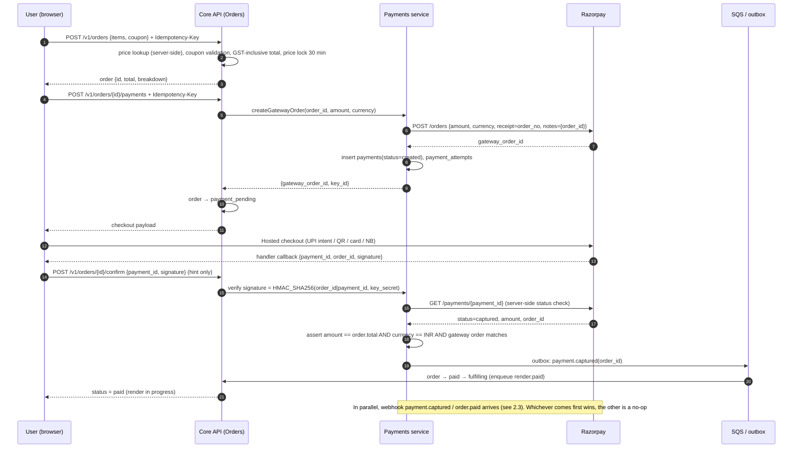
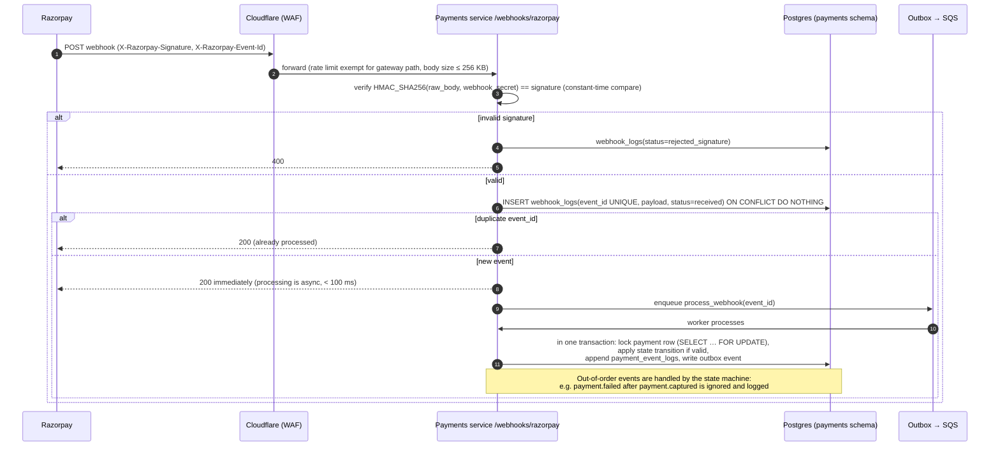
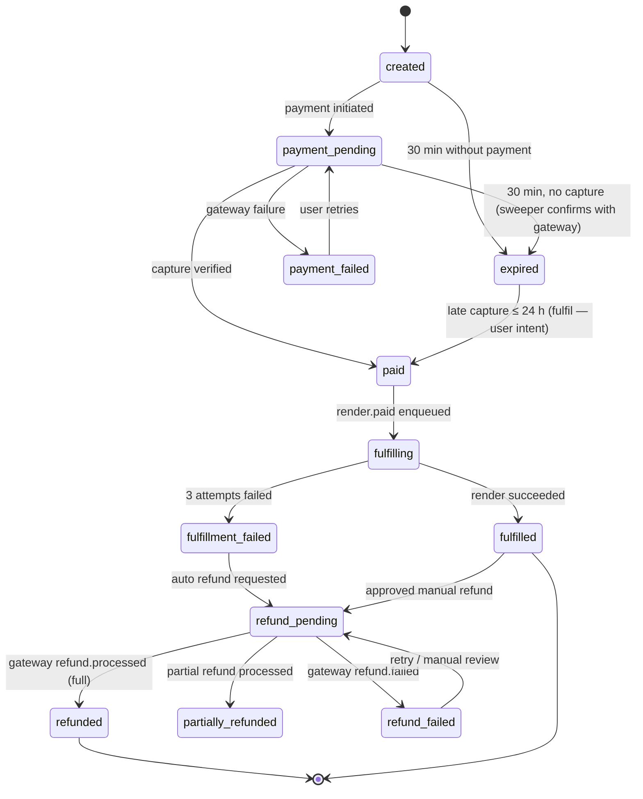
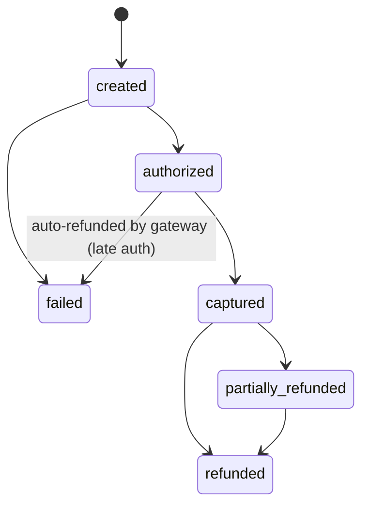
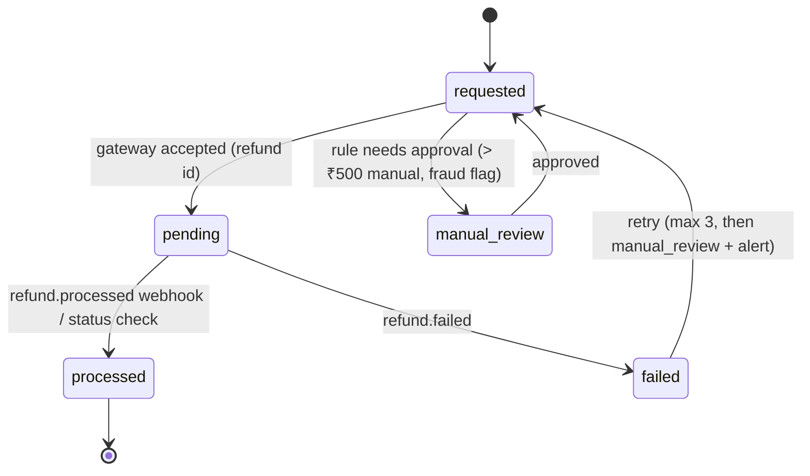
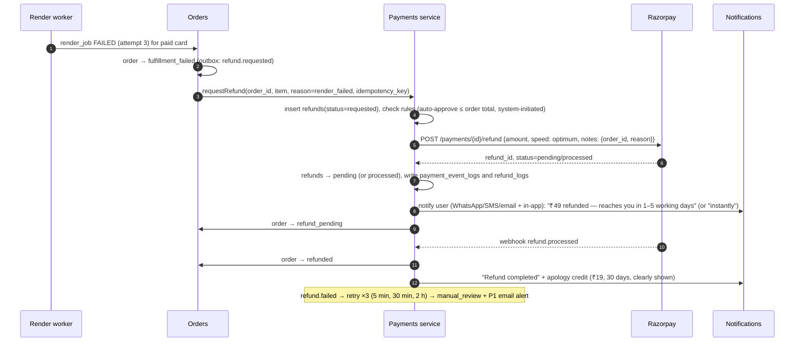
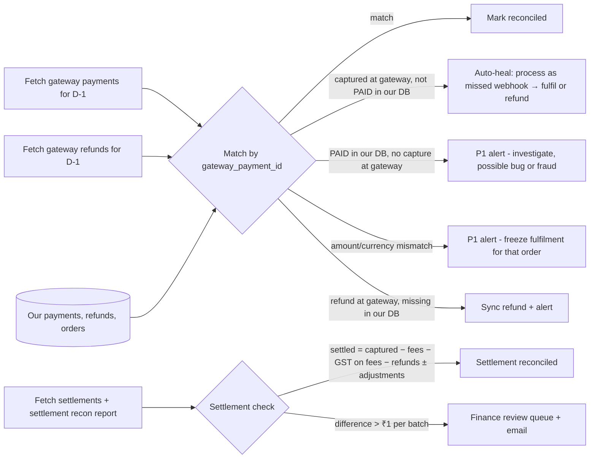

# 05 — Payments, Refunds and Reconciliation

**Status:** Draft v1 · **As of:** 2 October 2026 · **Owner:** Engineering (Payments) + Finance
Labels: **[V]** sourced · **[E]** estimate · **[A]** assumption.

**Principles**
1. **Never trust the client.** The server computes amounts. An order becomes PAID only after a **verified webhook** or a **server-to-gateway status check**.
2. **Idempotent everything.** Order creation, payment creation, webhook processing and refunds can each be repeated safely.
3. **Money never gets stuck.** Every captured payment ends in exactly one of two outcomes: *fulfilled* or *refunded*. A sweeper and daily reconciliation catch anything in between.
4. **Cards never touch our servers.** We use hosted checkout only, which keeps us at the smallest PCI DSS scope.
5. **Payment data stays in India** (AWS Mumbai), and access is limited to the payments service.

---

## 1. Gateway selection

| Criterion | **Razorpay** | **Cashfree** | **PayU** | PhonePe PG | Juspay (orchestrator) |
|---|---|---|---|---|---|
| UPI intent on mobile web, QR on desktop | Yes | Yes | Yes | Yes (strong UPI) | Via underlying PGs |
| Standard pricing (verify; negotiable) | ~2% domestic; UPI 0% MDR by policy but a platform fee may apply on standard plans **[V]** | ~1.6–1.95% band; new-merchant offers **[V]** | ~1.99% cards **[V]** | Competitive on UPI **[A]** | Platform fee on top of PG fees |
| Refund API, instant refunds | Yes; instant/"optimum" refund speed | Yes; instant refunds | Yes | Yes | Unified |
| Webhooks + signature verification | Mature | Mature | Mature | Good | Unified |
| Settlement | T+2 standard; faster options **[V]** | T+1, instant tier **[V]** | T+1 to T+3 **[V]** | — | — |
| Subscriptions with UPI Autopay (for the V1 Pass) | Yes | Yes | Yes | Yes | Yes |
| Developer experience and docs | Best-in-class | Very good | Good | Good | Good, but enterprise-oriented |
| Onboarding for an early-stage company | Fast | Fast | Moderate | Moderate | Not needed at MVP scale |

**Recommendation**
- **MVP: Razorpay as the single gateway.** It has the best docs, mature webhooks and refunds, support for UPI intent and QR, and native subscriptions for V1. A single gateway keeps the code paths simple while volume is small.
- **V1 (before Raksha Bandhan / Diwali 2027): add Cashfree as a secondary gateway** behind a thin `PaymentGateway` interface. Routing:
  - Default: primary.
  - **Automatic failover** when the primary's success rate for a method drops more than 10 points below its 1-hour baseline, or its error rate exceeds 5% over 5 minutes.
  - Manual override from the admin panel.
- **Later:** consider an orchestrator (e.g. Juspay) only once the extra cost is justified by payment volume.
- **What would change this:** a better negotiated rate or UPI success rate from another gateway in the pilot. We'll run the Diwali 2026 pilot on Razorpay Payment Links and compare.

---

## 2. Secure payment architecture

### 2.1 Components
- **Core API (Orders module):** creates orders, computes totals, holds the order state machine and grants entitlements.
- **Payments service** (separate deployable, separate DB role, secrets only it can read):
  - creates gateway orders;
  - receives webhooks;
  - records payment attempts;
  - runs refunds and reconciliation;
  - routes between gateways (V1).
- **Secrets:** gateway keys and webhook secrets live in AWS Secrets Manager, are rotated every 90 days, and are never present in the frontend except the public `key_id`.

### 2.2 Checkout sequence

**Capture settings:** **auto-capture** is on at the gateway, so authorised payments are captured immediately. Late authorisations that the gateway auto-refunds are recorded through webhooks.

### 2.3 Webhook handling

**Events handled:** `payment.authorized`, `payment.captured`, `payment.failed`, `order.paid`, `refund.created`, `refund.processed`, `refund.failed`, `payment.dispute.*` (V1: log + alert).

### 2.4 State machines

**Order**

**Payment**

**Refund**

**Transition rules (enforced in code and covered by tests):**
- Transitions are written as `UPDATE … SET status = :to WHERE id = :id AND status = ANY(:allowed_from)`. If zero rows change, the event is logged as `ignored_out_of_order` and doesn't fail.
- Every transition appends to `payment_event_logs` (append-only).

### 2.5 Idempotency
- **API layer:** an `Idempotency-Key` header is stored in Redis (24h) together with a hash of the request and the response. Same key + same body returns the cached response. Same key + a different body returns `409`.
- **Orders:** `orders.idempotency_key UNIQUE`.
- **Gateway orders:** one active gateway order per order and gateway (unique constraint). Retries reuse it.
- **Webhooks:** `webhook_logs.event_id UNIQUE`.
- **Refunds:** `refunds.idempotency_key UNIQUE`, formed as `{order_id}:{reason_code}:{sequence}`, and passed to the gateway's idempotency mechanism.

### 2.6 Payment-pending handling (common with UPI)
- **Client:** polls `GET /v1/orders/{id}` (every 3s for 2 min, then every 30s up to 15 min) and shows "Checking your payment…".
- **Server sweeper (every 1 min):** for orders in `payment_pending` older than 3 min, fetch the payment and order status from the gateway and apply it. After 30 min with no capture, mark the order `expired`.
- **Late capture after expiry:**
  - Within 24h: **fulfil**, because the user paid intending to buy, and notify them.
  - After 24h, or if the user has since bought the same item successfully: **auto-refund** with `late_capture_expired` or `duplicate_payment`.

---

## 3. Automatic refunds

### 3.1 What counts as a failure (auto-refund triggers)

| Trigger | Detection | Action | SLA |
|---|---|---|---|
| **Render/fulfilment failed** after a successful capture | `render_jobs` FAILED after 3 attempts (10s, 60s, 5 min backoff) for a `paid` item | Full refund of that item (partial if a bundle), `reason=render_failed`, `speed=optimum` (instant where available) | Initiated ≤ 30 min after capture |
| **Duplicate payment** (two captures for one order) | Webhook processing or sweeper finds > 1 captured payment for an order | Refund every capture except the first, `reason=duplicate_payment` | Initiated ≤ 15 min |
| **Late capture on an expired/cancelled order** (> 24h) | Webhook/sweeper | Refund, `reason=late_capture_expired` | ≤ 15 min |
| **Order not fulfillable** (template retired or license revoked between payment and render) | Fulfilment pre-check | Refund + apology credit | ≤ 15 min |
| **Fraud flag** (stolen instrument signal from the gateway, abuse rules) | Risk rules | Refund + block, `reason=fraud`, needs finance approval | Same day |
| **Customer quality complaint** (manual) | Support ticket within 7 days | Support refund ≤ ₹500; above that, finance approval (maker-checker) | ≤ 2 working days |

**Before refunding a render failure, we try to recover:**
1. Retry on a different worker and instance type.
2. Re-render at a lower quality tier (1080p → 720p) **only if the user agrees**. We don't do this silently.
3. If both fail, refund.

### 3.2 Refund flow

### 3.3 Communication
- Messages go out in the **user's locale**, through every channel they consented to, plus in-app status.
- My Orders shows a refund timeline: *Requested → Sent to bank → Completed*, with the gateway refund reference (and the bank RRN/ARN when available) so the user can raise it with their bank.

---

## 4. Reconciliation

### 4.1 Intraday (every 5 min)
- **Sweeper:** `payment_pending` orders older than 3 min → status pull from the gateway.
- **Stuck checks:**
  - `paid` orders not `fulfilled` within 15 min → re-enqueue the render and alert if this repeats.
  - `refund_pending` older than 24h → status pull, and alert if still unresolved.

### 4.2 Daily (06:00 IST, for the previous day)

- Results go to `recon_runs` (summary) and `recon_mismatches` (each mismatch, its type, resolution and resolver).
- A **daily email to finance** with totals: captured, refunded, fees, GST on fees, settled, open mismatches.
- **Monthly:** match GST invoices and credit notes to orders and refunds, for GST filing.

---

## 5. Compliance

| Area | Requirement | How we meet it |
|---|---|---|
| **PCI DSS** | Smallest scope | Hosted checkout / gateway-hosted fields; card data never reaches our servers; target **SAQ A**; strict CSP so only the gateway's scripts load on the checkout page |
| **RBI card tokenisation (CoF)** | Merchants must not store card numbers | We store no card data; saved cards, if offered, are tokenised by the gateway |
| **RBI payment aggregator rules** | Use an RBI-authorised PA | Razorpay/Cashfree are authorised PAs; we never hold customer funds (shagun is P2P to the host's UPI ID; see PRD §4.4) |
| **Payment data localisation** | RBI expects payment system data to be stored in India | Gateways store it in India; **our payment records are in AWS Mumbai**, with backups in Hyderabad |
| **UPI rules** | P2P collect requests stopped from 1 Oct 2025; merchant flows continue **[V]** | We use **intent (mobile) and QR (desktop)**; no collect requests |
| **e-mandates (V1 Pass)** | Recurring rules: additional-factor authentication exemption for recurring debits up to the RBI limit; **pre-debit notification ≥ 24h** before each charge | Autopay is opt-in; we send our own reminder 3 days before renewal in addition to the bank's pre-debit notice; one-tap cancel |
| **GST** | 18% on online digital services **[A: confirm with a CA]** | GST-inclusive prices; tax invoice with GSTIN, SAC, place of supply (user's state, collected at checkout); **credit notes** for refunds; monthly filing support from recon data |
| **Consumer Protection (E-Commerce) Rules, 2020** | Seller details, total price, refund/cancellation policy, grievance officer, acknowledge complaints within 48h and resolve within 1 month | Footer and checkout links; grievance page; ticketing SLA |
| **Refund policy (user-facing, 4 languages)** | Clear before payment | **Automatic full refund if your card fails or you're charged twice. Quality issues reported within 7 days are reviewed. Once a working HD card has been delivered, change-of-mind refunds aren't offered, but you get free edits during your edit window.** |
| **Disputes/chargebacks** | Respond within the gateway's timelines | Evidence pack generated automatically: order, IP/device, render delivery and download logs, share events |

---

## 6. Key decisions (payments)
- **Razorpay** for the MVP; **Cashfree** as a V1 failover through a gateway abstraction with health-based routing.
- **Webhook and server status check are the source of truth**, with HMAC verification, event de-duplication and an idempotent state machine.
- **Automatic refunds** for render failures, duplicates and late captures, using instant/optimum speed where available, initiated within 30 minutes.
- **Reconciliation:** a 5-minute sweeper + a daily 3-way match (orders ↔ gateway payments ↔ settlements) + a monthly GST match.
- **SAQ A PCI scope**; payment data in India; GST credit notes for refunds.

## 7. Open questions for the founder
1. Is the company **incorporated with a current account**? Gateway KYC needs the company PAN, GST registration (or a reason for exemption), and the bank account.
2. Is the **apology credit (₹19) on failure** acceptable? It costs little and buys a lot of trust.
3. Should **refunds ≤ ₹500 for quality complaints** go to support without finance approval?
