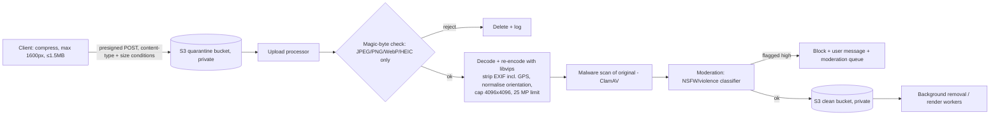

# 07 — Security, Abuse Prevention and Data Protection

**Status:** Draft v1 · **As of:** 2 October 2026 · **Owner:** Engineering (Security) + Legal
Labels: **[V]** sourced · **[E]** estimate · **[A]** assumption.

---

## 1. Threat model (STRIDE)

**Assets:** money flows (orders, payments, refunds), user personal data (phone numbers, photos, names, family details in invitations, RSVP guest data), paid template assets (our IP), admin powers (pricing, refunds, publishing), brand trust (offensive content on our domain), availability on festival days.

**Trust boundaries:** browser ↔ Cloudflare edge ↔ AWS origin; origin ↔ payment gateway (API + webhooks); origin ↔ messaging providers; admin users ↔ admin app; render workers ↔ user-supplied content (photos, text).

| STRIDE | Threat | Example in our system | Primary controls |
|---|---|---|---|
| **S**poofing | Account takeover through OTP abuse or SIM swap; forged gateway webhooks; admin impersonation | Attacker brute-forces OTPs; posts a fake `payment.captured` | OTP rate limits + lockout + Turnstile; short OTP TTL (5 min), 6 digits; webhook HMAC + event de-dup + server status check; admin SSO + MFA through Cloudflare Access |
| **T**ampering | Price manipulation from the client; editing someone else's card; tampering with template assets | Client sends `amount=1` | Server-side pricing only; object-level authorisation; signed, versioned assets with checksums; immutable `price_history` |
| **R**epudiation | Support/finance denies issuing a refund; user disputes a purchase | "I never approved that ₹5,000 refund" | Append-only `audit_logs` (INSERT-only role, WORM archive); maker-checker; evidence packs for disputes |
| **I**nformation disclosure | Guessing card/event URLs; leaking photos via public buckets; PII in logs; IDOR on orders/RSVPs | Enumerating `/c/1`, `/c/2`… | 128-bit random slugs; private S3 for originals; renders have unguessable keys; owner can make private/delete; PII masking; no sequential IDs exposed |
| **D**enial of service | Festival-day floods, bot traffic, render-queue flooding, SMS pumping (cost DoS) | Bots trigger 1M free video renders | Cloudflare DDoS/WAF/bot management; per-device/IP render quotas; queue priorities; OTP abuse controls; budget alarms |
| **E**levation of privilege | Normal user reaches admin APIs; SSRF from render workers into the cloud metadata service; malicious upload exploits the image library | An SVG/HTML payload in a "photo"; a URL fetch to `169.254.169.254` | Admin app on a separate domain behind Zero Trust; RBAC; workers in isolated subnets with no IMDS access (IMDSv2 hop limit 1 + network policy); strict upload pipeline (§3) |

---

## 2. OWASP Top 10 (2021) and OWASP API Security Top 10 (2023) controls

| Risk | Where it bites us | Control |
|---|---|---|
| **A01 Broken access control / API1 BOLA / API5 BFLA** | `/me/orders/{id}`, `/cards/{id}`, `/events/{id}/rsvps` export, admin endpoints | A central policy layer (NestJS guards): every resource fetch checks `owner_id = current_user` or a role; deny by default; automated IDOR tests in CI for each route; admin routes only on the admin domain and roles |
| **A02 Cryptographic failures** | Tokens, PII at rest | TLS 1.2+ everywhere (HSTS preload); AES-256 at rest (RDS/S3/EBS with KMS); phone HMAC with a KMS-held key; refresh tokens stored hashed (SHA-256) |
| **A03 Injection** | Search, filters, admin queries | Parameterised queries only (ORM/query builder); no string-built SQL; validation with schemas (zod/class-validator); FFmpeg called with **argument arrays, never a shell**, and user text never goes into filter strings (text becomes PNG layers) |
| **XSS** (A03) | **User-entered names and messages shown on recipient/event pages**; RSVP messages in the host dashboard | React auto-escaping; **no `dangerouslySetInnerHTML`** for user content; strict CSP (`default-src 'self'`, nonce-based scripts, `object-src 'none'`, `frame-ancestors 'none'`, gateway domains allowed only on checkout); Unicode normalisation (NFC) and stripping of control/bidi-override characters (Trojan Source-style spoofing) |
| **CSRF** | Cookie-based sessions | SameSite=Lax cookies + CSRF token (double-submit) on state-changing requests; `Origin` header checks |
| **A04 Insecure design** | Refund abuse, coupon abuse | Business-rule limits (per-phone coupon limits, refund maker-checker, velocity rules); abuse cases written into user stories |
| **A05 Security misconfiguration** | Public buckets, verbose errors, open admin | Terraform with policy-as-code (tfsec/Checkov); S3 Block Public Access; generic errors (problem+json without stack traces); security headers |
| **A06 Vulnerable components** | npm supply chain; FFmpeg/Chromium/libvips CVEs | Dependabot/Renovate; `npm audit` + OSV scanning in CI; lockfile enforcement; minimal base images (distroless) rebuilt weekly; pinned versions of FFmpeg, Chromium and libvips with a CVE watch |
| **A07 Identification and authentication failures / API2** | OTP brute force, session theft | OTP: 6 digits, 5-min TTL, max 5 verify attempts per code, max 5 sends per phone per hour and 10 per day, per-IP/ASN limits, Turnstile on send; sessions: 15-min access JWT + rotating refresh with reuse detection; logout everywhere |
| **A08 Software and data integrity** | Unverified webhooks; template asset tampering; CI pipeline | HMAC webhooks; signed container images (cosign) and a deploy-time verification policy; template assets checksummed; GitHub branch protection + required reviews; OIDC to AWS (no long-lived CI keys) |
| **A09 Logging and monitoring failures** | Missed attacks | See `06-observability-and-analytics.md`; security alerts (signature failures, OTP abuse, admin anomalies) |
| **A10 SSRF** | "Import photo from URL" (if ever), webhook URLs, map-link previews | **No server-side fetching of user-supplied URLs in the MVP.** Uploads only from the device. Map links are validated against an allowlist (Google Maps domains) and never fetched server-side. Workers can't reach the metadata service or internal networks except the APIs they need (egress allowlist) |
| **API3 Broken object property level authorisation** | Mass assignment (`status`, `price` in a PATCH) | DTO allowlists; responses serialised through explicit view models |
| **API4 Unrestricted resource consumption** | Renders, AI, uploads, OTP | Quotas per device/user/IP; max upload size; max photos per template; AI limits; **cost budgets with alarms** |
| **API6 Unrestricted access to sensitive business flows** | Bulk-scraping paid templates; coupon farming | Bot management; signed URLs; per-phone coupon rules; device fingerprint signals (privacy-preserving) |
| **API7 SSRF** | (above) | (above) |
| **API8 Misconfiguration** | CORS too broad | CORS allowlist of our origins only; no wildcard with credentials |
| **API9 Improper inventory** | Forgotten debug/staging endpoints | API inventory from OpenAPI specs; staging behind Cloudflare Access; route-level tests |
| **API10 Unsafe consumption of APIs** | Trusting gateway/BSP responses blindly | Validate every external response against a schema; verify amount, currency and order match; timeouts + circuit breakers |

---

## 3. File-upload security (photos)

- **Allowed:** JPEG, PNG, WebP, HEIC (converted). **Rejected:** SVG, GIF, TIFF, PDF and anything that fails magic-byte detection.
- Presigned POST conditions enforce `content-length-range` (≤ 10MB) and content type. The upload URL expires in 5 min.
- **Re-encoding** neutralises polyglot files and parser exploits. Decoders run in a sandboxed worker with seccomp and no network access, except to S3.
- **EXIF stripping** removes GPS location from family photos, which is a real privacy risk.
- Originals are deleted 30 days after the card is finalised (unless the user keeps a draft). Rendered outputs are kept while the card exists.

---

## 4. Abuse prevention

| Abuse | Controls |
|---|---|
| **OTP abuse / SMS pumping** (fraudsters trigger OTPs to premium-rate numbers to earn from SMS charges) | **WhatsApp OTP first** (pumping isn't viable on that channel); SMS only as a fallback; Indian numbers (+91) only for SMS; Turnstile on send; per-phone/IP/ASN/device velocity limits; number-range anomaly detection; daily SMS spend cap with an alert (A16) |
| **Bot sign-ups / fake accounts** | Accounts only through a verified phone/Google; Turnstile; device signals; disposable-email block (email is never the primary identity) |
| **Coupon and referral fraud** | One first-purchase coupon per **verified phone**; referral credit only after the referee's **paid** order, not refunded within 7 days; self-referral checks (same device/payment instrument); a monthly cap per referrer; manual review above thresholds |
| **Scraping of paid templates** | Premium previews are always watermarked and capped at 720px; HD assets are **never** sent to the client before payment (server-side render only); signed, short-lived URLs for HD downloads (24h); hotlink protection; Cloudflare bot management + rate limits on catalog APIs; invisible forensic watermark (ID of the purchasing order) in HD outputs (V1) |
| **Render/AI resource abuse** | Quotas per device/day (e.g. 30 free renders, 10 AI calls); priority queues; anomaly alarms |
| **Refund abuse** | Quality refunds need a ticket with a reason; repeat refund requesters are flagged; maker-checker above ₹500; download/share evidence is checked |
| **Spam via recipient replies / RSVP** | Turnstile + rate limits; profanity filter; host can disable replies |
| **DDoS** | Cloudflare (always-on L3/L4/L7), WAF managed rules + custom rules for sensitive paths (OTP, checkout, RSVP), "Under attack" mode playbook |

---

## 5. Content moderation (IT Rules compliance)

- **Scope:**
  - User text (names, messages, RSVP messages, replies).
  - User photos.
  - Shared cards and event pages hosted on our domain.
- **Pre-publication checks:**
  - **Text:** a multilingual profanity/abuse lexicon (Hindi, Marathi, Tamil, English + Hinglish transliterations) + an LLM-based classifier for hate, sexual content and violence. High-severity text is blocked with a polite message in the user's language.
  - **Photos:** NSFW/violence classifier. High-confidence violations are blocked; medium confidence goes to the moderation queue while the card stays **private**.
  - **Religious-sensitivity rules:** user text over deity imagery is disabled by template design (no editable slots overlapping deities).
- **Post-publication:**
  - A "Report" link on every recipient and event page.
  - Reports go into a moderation queue with SLAs:
    - **3 hours** for content flagged as unlawful under the IT Rules amendment of 2026 **[V]**.
    - 24h for other reports.
  - Takedown disables the link immediately. Repeat offenders are blocked.
- **Grievance officer:** named on the website with contact details. Complaints are acknowledged within 24h and resolved within the timelines the IT Rules mandate.
- **AI-generated content labels:** any AI-generated visual that could appear real carries a **continuous, visible "AI-generated" label**, as required by the IT Rules amendment of 2026 **[V]**. The MVP avoids such content altogether (see PRD §9).
- **Records:** every moderation decision is logged in `audit_logs` with the reason, for legal defence.

---

## 6. Platform security

| Area | Controls |
|---|---|
| **Secrets** | AWS Secrets Manager (gateway keys, webhook secrets, provider API keys); 90-day rotation; never in the repo or env files; CI uses GitHub OIDC → AWS roles; secret scanning (GitHub push protection + gitleaks) |
| **Encryption** | In transit: TLS 1.2+ (Cloudflare ↔ origin with Full (strict) mode + an origin certificate). At rest: KMS-encrypted RDS, S3, EBS and ElastiCache. Field-level encryption for `rsvps.phone_e164` and `events.shagun_upi_id` |
| **IAM / least privilege** | Separate AWS accounts for prod/staging (AWS Organizations); a task role per service (render workers: read assets + write outputs only; payments: only its secrets); separate Postgres roles per module schema; the payments schema is readable only by the payments service and a read-only finance reporting role; break-glass admin access with MFA and alerts |
| **Network** | Private subnets for services/DB; ALB only reachable from Cloudflare IP ranges (security group) + authenticated origin pulls; workers without public IPs, egress through NAT with an allowlist |
| **Admin** | Separate admin domain behind **Cloudflare Access** (SSO, MFA, device posture); RBAC roles: content, pricing, support, finance, admin; maker-checker for refunds > ₹500 and price changes during festival windows; session timeout 30 min |
| **Supply chain** | Lockfiles; Renovate with auto-merge only for patch updates that pass tests; SBOM per build (Syft); image scanning (Trivy) blocks critical CVEs; signed images (cosign) |
| **Backups and DR** | RDS automated backups (35 days) + PITR; daily snapshot copied to **ap-south-2 (Hyderabad)**; S3 versioning + cross-region replication for orders/invoices; **quarterly restore drill**; DR runbook with an RTO ≤ 8h |
| **Security testing** | SAST (Semgrep) + dependency scanning on every PR; DAST (OWASP ZAP) weekly on staging; **external penetration test before public launch** and annually; bug bounty (V1) |
| **Incident response** | Severity matrix; on-call; a CERT-In reporting process (**report cyber incidents within 6 hours** under the CERT-In directions of 2022) and logs retained as those directions require; user notification templates in 4 languages |

---

## 7. DPDP Act 2023 compliance

**Timeline:** the DPDP Rules were notified on 14 Nov 2025. Consent-manager provisions take effect on 13 Nov 2026, and substantive obligations are due by **13 May 2027** **[V]**. Our public launch (Q1 2027) comes before the full deadline, so we **build compliant from day 1** rather than retrofitting.

| Obligation | Implementation |
|---|---|
| **Notice** (itemised: what data, purpose, how to withdraw, how to complain) | A short, plain notice in **hi/en/mr/ta**, shown at first use and before photo upload/OTP; a link to the full privacy policy; versioned (`notice_version` in `consents`) |
| **Consent** (free, specific, informed, unambiguous; withdrawable as easily as given) | Separate toggles: essential (no consent needed), analytics, marketing via WhatsApp, marketing via email, reminders; unticked by default; withdraw in Settings with one tap; records kept in `consents` |
| **Purpose limitation and minimisation** | Photos are used only to render the card; no face recognition; no training of models on user photos; RSVP collects name + count (phone optional); no contact-list upload in the MVP |
| **Retention and erasure** | Originals deleted 30 days after finalisation; drafts 90 days after last edit; account deletion completes within 30 days; inactive accounts are notified, then deleted after 3 years of inactivity **[A: align with Rules' retention schedules]**; financial records kept as tax law requires (exempted) |
| **Data principal rights** (access, correction, erasure, grievance, nominee) | Self-serve export (JSON + media zip) and deletion in My Account; correction of profile fields; grievance contact; nomination form (V1) |
| **Children's data** | Accounts are for **18+ only** (declared at signup). We avoid behavioural tracking or targeted ads to children. Under-18 accounts would need verifiable parental consent; this is out of scope for the MVP |
| **Security safeguards** | §6 controls; encryption; access control; logs kept for at least 1 year for security purposes |
| **Breach notification** | Notify the Data Protection Board and affected users without delay, with a detailed report within the prescribed timeline (72h under the Rules **[A: confirm]**); runbook + notice templates in 4 languages; also CERT-In (6h) |
| **Processors** | Data processing agreements with AWS, Cloudflare, Razorpay, the messaging providers, PostHog, Sentry and the LLM provider; no transfer to restricted countries; an LLM provider configuration that **does not use our data for training** |
| **Consent managers** | Not required for the MVP; we monitor how consent managers integrate after Nov 2026 |
| **Significant Data Fiduciary** | Unlikely at our scale; we re-assess annually |

---

## 8. Key decisions (security)
- **Hosted checkout, webhook HMAC + server verification, server-side pricing.** The payment flow has no client trust.
- **A strict upload pipeline:** quarantine → magic bytes → re-encode → EXIF strip → malware scan → moderation. No server-side URL fetching (no SSRF).
- **WhatsApp-first OTP** to stop SMS pumping, with layered rate limits and Turnstile.
- **Admin behind Zero Trust**, with RBAC, maker-checker and an immutable audit log.
- **DPDP-compliant from day 1**, with notices in 4 languages, granular consent, self-serve deletion and 18+ accounts.

## 9. Open questions for the founder
1. Should we appoint an external **DPO/legal advisor** for DPDP and the IT Rules before launch? Recommended: a part-time retainer.
2. Budget for an **external penetration test** before launch: about ₹1.5–3 lakh for a web + API scope **[E]**.
3. Should the minimum account age be 18? An under-18 student segment (persona P5, ages 18–24, is unaffected) would need a parental-consent flow later.
