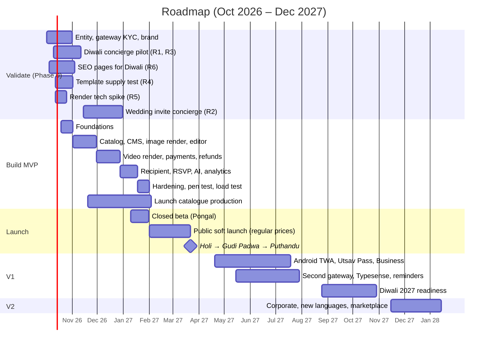

# 08 — Roadmap, Team, Cost, Risks and Go-to-Market

**Status:** Draft v1 · **As of:** 2 October 2026 · **Owner:** Founder + Product
Labels: **[V]** sourced · **[E]** estimate · **[A]** assumption. Currency: ₹; ₹88 = US$1 for cloud prices **[A]**.

---

## 1. The calendar we're building against

| Date | Moment | Relevance |
|---|---|---|
| 20 Oct 2026 | Dussehra **[V]** | Pilot warm-up |
| 6–11 Nov 2026 | Dhanteras → **Diwali (8 Nov)** → Bhai Dooj **[V]** | **Validation pilot (R1)**: 5 weeks away, too soon to launch the product |
| Nov–Dec 2026 | Wedding season (46 lakh weddings in the 2025 equivalent **[V]**) | **Invitation concierge pilot (R2)** |
| 14–15 Jan 2027 | Makar Sankranti / **Pongal (15 Jan)** / Lohri **[V]** | **Closed beta** (Tamil + Marathi + Hindi) |
| 26 Jan, 14 Feb 2027 | Republic Day, Valentine's Day | Public soft launch at regular prices (builds honest price history) |
| ~9–10 Mar 2027 | Eid al-Fitr (moon sighting) **[A: verify]** | Eid collection |
| **22 Mar 2027** | **Holi** **[V]** | **Public launch moment #1** (Hindi belt) |
| **7 Apr 2027** | **Gudi Padwa** / Ugadi **[V]** | **Launch moment #2** (Marathi) |
| **14 Apr 2027** | **Puthandu** (Tamil New Year) / Baisakhi / Vishu | **Launch moment #3** (Tamil) |
| Apr–Jun 2027 | Summer wedding season | Invitation revenue |
| 17 Aug 2027 | Raksha Bandhan **[V]** | V1 scale test #1 (Android app live) |
| 4 Sep 2027 | Ganesh Chaturthi **[V]** | Huge for Marathi |
| 30 Sep – 9 Oct 2027 | Navratri → Dussehra **[V]** | |
| **29 Oct 2027** | **Diwali** **[V]** | **The big one**: 1M MAU target |

> Lunar festival dates must be re-verified against a panchang source before campaigns are scheduled (see PRD §7.7).

**Why launch on Holi → Gudi Padwa → Puthandu rather than an earlier festival:**
- **Time:** about 15 weeks of build plus 8 weeks of template production make March the earliest safe date for a public launch.
- **Three festivals in four weeks**, one for each launch language: Hindi (Holi), Marathi (Gudi Padwa), Tamil (Puthandu). Each language gets its own hero moment, and we learn three times in a month.
- **Honest discounts:** selling at regular prices from 1 Feb makes Holi's festive discounts **genuine** under our price-honesty rule.
- **Revenue:** the April–June wedding season follows straight away for invitations.
- **Time to fix things:** six months to harden before Raksha Bandhan, Ganesh Chaturthi and Diwali 2027.

---

## 2. Milestone roadmap

### Phase 0: Validate (2 Oct – 31 Dec 2026)
- Incorporation/KYC, GST registration, Razorpay account, brand name + domains, trademark filing.
- **R1 Diwali concierge pilot:** landing page (hi/mr) + 20 premium templates + Payment Links + a designer on call. ₹19/₹29/₹49 price test.
- **R2 wedding concierge:** 25 invite templates (hi/mr/ta), watermarked previews by WhatsApp, pay to unlock.
- **R3/R6:** viral link tracking; 60 SEO pages.
- **R4/R5:** supply test with 3 freelancers per language; render spike.
- **Exit criteria:** see the pass bars in PRD §3. **Go/no-go meeting on 15 Dec 2026** to set the final MVP scope (greetings vs. invitations emphasis).

### Phase 1: MVP build (19 Oct 2026 – 31 Jan 2027, ~15 weeks)

| Weeks | Scope |
|---|---|
| 1–2 | Monorepo, Terraform (dev/staging/prod), CI/CD, auth (OTP + Google), i18n skeleton (4 locales), design system + festival tokens |
| 3–6 | Festival calendar, catalog + collections + search (Postgres + aliases), admin CMS v1 (templates, variants, pricing + price history), **template scene schema + image render pipeline**, guided editor + live preview, uploads pipeline |
| 7–10 | **Video render pipeline** (FFmpeg + Chromium layers), render queues + priorities, **orders + Razorpay + webhooks + state machines + auto-refunds + sweeper + daily reconciliation**, checkout UX, My Cards, GST invoices |
| 11–13 | Recipient page + viral CTA, event page + RSVP + host dashboard, AI wish writer, transliteration, background removal, badges/metrics jobs, PostHog events, log tables, alerting (SES + Grafana), notifications (WhatsApp/SMS/email/push) |
| 14–15 | Security hardening, **external pen test**, k6 load test at 2x target, accessibility audit, content load (launch catalogue), beta onboarding |

**MVP launch catalogue** (published by 31 Jan 2027, expanded for each festival):

| Type | hi | mr | ta | en | Total |
|---|---|---|---|---|---|
| Image greetings (festivals Jan–Apr + evergreen wishes) | 180 | 80 | 80 | 60 | **400** |
| Video greetings | 25 | 12 | 12 | 11 | **60** |
| Image invitations | 20 | 12 | 12 | 6 | **50** |
| Video invitations (3 tiers) | 12 | 8 | 8 | 2 | **30** |

### Phase 2: V1 (Apr – Oct 2027)
- **Android app (TWA)** on the Play Store with Play Billing / user-choice billing for in-app digital purchases (model the fee impact first).
- **Utsav Pass** (opt-in autopay, pre-debit notices, one-tap cancel). **Business Plan** (branding layer, daily post).
- Birthday/anniversary reminders, "My people", the **Good Morning** daily collection.
- **Second gateway (Cashfree)** with health-based routing; Typesense search; recommendations; scheduled WhatsApp sends.
- Forensic watermarking; bug bounty; session replay (5%, with consent).
- **Diwali 2027 readiness** programme (runbook in `04-system-design.md` §7.3).

### Phase 3: V2 (Nov 2027 →)
- Corporate/HR bulk (CSV personalisation, brand kits, invoices).
- New languages: Telugu, Bengali, Gujarati, Kannada.
- Creator marketplace (revenue share 30–50%).
- Digital shagun (UPI intent to the host) and gift-card partners.
- NRI/international pricing; re-evaluate native apps.

---

## 3. Team for the MVP

| Role | FTE | Responsibilities | Monthly cost (₹) **[E]** |
|---|---|---|---|
| Founder / Product lead | 1 | PRD, pricing, partnerships, pilots, support until launch | — |
| Product designer (UX/UI) | 1 | Flows, design system, festival themes, usability tests in 4 languages | 1.2–2.0 L |
| Lead full-stack engineer (TypeScript) | 1 | Architecture, Next.js + NestJS, code quality | 2.5–3.5 L |
| Full-stack engineer | 1 | Catalog, editor, recipient/event pages, admin | 1.5–2.2 L |
| Backend / infra engineer | 1 | Payments, render pipeline, AWS/Terraform, observability, security | 2.2–3.0 L |
| Template and motion design lead | 1 | Template system, QA, freelancer management, music licensing | 1.0–1.5 L |
| Language leads (hi, mr, ta) | 3 × part-time | Copy, glossary, typography QA, SEO wishes pages | 0.9–1.5 L (combined) |
| QA (contract) | 0.5 | Test plans, device lab, regression for each festival | 0.4–0.6 L |
| Growth marketer (from Dec 2026) | 1 | Pilots, ads, creators, SEO operations, CRM | 1.0–1.5 L |
| Customer support (from launch) | 1 (part-time → full) | WhatsApp/email support in hi/mr/ta/en | 0.3–0.5 L |
| **Total payroll** | | | **≈ ₹11–16 L/month** |

**Freelancer pool:** 6–10 designers (illustration, motion) across the language markets.
- Launch catalogue budget: **₹10–14 L** (400 image × ~₹1,200 + 90 video × ~₹7,000 + revisions) **[E]**.

**Other one-off costs** **[E]**:
- Legal/compliance setup (T&C, privacy, DPDP, IT Rules, music/font licences): ₹2–4 L.
- External pen test: ₹1.5–3 L.
- Premium display fonts: ₹1–3 L.
- Music library: ₹1–2 L.

**Runway to Diwali 2027 (13 months), estimate:**
- Payroll: ₹1.6–2.1 Cr.
- Templates: ₹0.35–0.5 Cr (launch + 4 festival cycles).
- Marketing: ₹0.4–0.7 Cr.
- Infra and tools: ₹0.08–0.15 Cr.
- One-offs: ₹0.06–0.12 Cr.
- **Total ≈ ₹2.5–3.5 Cr**, before revenue.

---

## 4. Monthly infrastructure cost estimates **[E]**

| Line item (₹/month) | 10K MAU | 100K MAU | 1M MAU |
|---|---|---|---|
| Web/API/payments compute (ECS Fargate) | 6,000 | 31,000 | 1,80,000 |
| PostgreSQL (RDS Multi-AZ + replicas) | 12,000 | 58,000 | 3,00,000 |
| Redis (ElastiCache) | 2,000 | 8,000 | 53,000 |
| Render + AI workers (Spot + on-demand base; festival peaks amortised) | 6,000 | 18,000 | 1,30,000 |
| Load balancer, NAT, data transfer | 5,000 | 13,000 | 70,000 |
| Object storage (R2 public media + S3 private) | 1,000 | 5,000 | 58,000 |
| Cloudflare (plan, WAF, bot, Turnstile) | 2,000 | 22,000 | 1,00,000–2,00,000 |
| Messaging: OTP + notifications (WhatsApp/SMS) | 2,000 | 21,000 | 2,60,000 |
| Email (SES) | <500 | 1,000 | 8,000 |
| LLM wish writer | 500 | 3,000 | 30,000 |
| Observability (Grafana Cloud + Sentry) | 2,500 | 16,000 | 1,20,000 |
| Product analytics (PostHog) | 0 (free tier) | 9,000 | 1,00,000 |
| **Total (approx.)** | **₹40–50k** | **₹2.0–2.5 L** | **₹12–15 L** |

**Main cost drivers and how to optimise them:**
1. **Messaging (WhatsApp/SMS):** the largest line at scale.
   - Use **web push** for reminders wherever the user allows it.
   - Batch notifications and enforce frequency caps.
   - Use WhatsApp authentication templates (cheaper than SMS, and they defeat SMS pumping).
   - Use OTP only at checkout or login, never for browsing.
2. **Database:**
   - Push catalog reads to the edge and Redis.
   - Archive logs to S3 after 30–90 days.
   - Move to Aurora I/O-optimised only if I/O dominates.
3. **Media delivery:** R2 has zero egress fees **[V: vendor pricing]**, and we aim for ≥ 90% CDN offload. Video previews are short (6–8s loops) and AVIF/WebP posters keep grids light.
4. **Render compute:**
   - Spot instances for most jobs.
   - Deterministic render keys, so identical requests don't re-render.
   - Pre-rendered backgrounds.
   - 720p by default for greetings; 1080p only for premium invitations.
5. **Analytics:** sample high-volume impression events (batched); move to self-hosted PostHog/ClickHouse above ~50M events a month.
6. **Credits:** apply for AWS Activate, Cloudflare for Startups and PostHog for Startups. Credits can cover most of the first year's infrastructure.

---

## 5. Top 10 risks

| # | Risk | Type | Likelihood | Impact | Mitigation |
|---|---|---|---|---|---|
| 1 | **Low willingness to pay** for greetings on the web | Market | Medium | High | Validate in the Diwali pilot (R1); invitations as the revenue engine; packs; Pass in V1; decision rule in PRD §3 |
| 2 | **A large free player copies us**: Canva's festival push (India is its 4th market and growing fast **[V]**) or Crafto adding invitations/web | Market | High | High | Win on language-native quality (Marathi/Tamil typography), speed to a finished card, invitations + RSVP, the recipient loop, trust and refunds; build an SEO moat early; partnerships (venues, pandits, caterers) |
| 3 | **Seasonality**: cash-flow and traffic troughs between festivals | Business | High | Medium | Invitations (year-round), birthdays, daily Good Morning (V1), Business Plan (daily posts), wedding seasons |
| 4 | **CAC too high**: Crafto's ads were 62% of its costs **[V]** | Market | Medium | High | Organic first: SEO in 4 languages, recipient → creator loop, referrals, creators; strict CAC guardrails per channel; pause channels that miss targets |
| 5 | **Video render cost or latency at festival peaks** | Technical | Medium | High | R5 spike; Spot + on-demand base; priority queues; pre-rendering; kill switches; load tests 4 and 1 weeks before each festival |
| 6 | **Payment gateway outage or low UPI success on festival day** | Technical | Medium | High | Secondary gateway with health routing (V1); success-rate alerts; UPI intent + QR; sweeper + automatic refunds; a gateway contact before every festival |
| 7 | **Template supply quality/cost** in Marathi and Tamil | Operational | Medium | High | R4 supply test; native-language leads; QA checklist; AI-assisted backgrounds with curation; template ROI to focus spend |
| 8 | **Legal: music/font/stock licensing, religious-sensitivity backlash, IT Rules takedowns** | Regulatory | Medium | High | Licence register; no film songs; cultural review; report + 3h takedown process; grievance officer |
| 9 | **Data protection incident** (family photos, RSVP data) | Regulatory/Security | Low | Very high | Upload pipeline, encryption, least privilege, pen test, DPDP-by-design, breach runbook (CERT-In 6h) |
| 10 | **Trust erosion from aggressive conversion tactics** (and CCPA dark-pattern exposure) | Regulatory/Brand | Low (by design) | High | Data-driven badges, price-honesty rule, no subscription traps, quarterly dark-pattern self-audit |

---

## 6. Go-to-market plan

### 6.1 Positioning and messages (in each language)
- **Promise:** "Your language. Your photo. Ready in a minute."
- **Proof points:**
  - "Pay once — no autopay."
  - "Auto-refund if anything fails."
  - "Made by [Marathi/Tamil/Hindi] designers" (native, not translated).
- **Per-language hero campaigns:**
  - Hindi: Holi, "रंग अपने, कार्ड अपना".
  - Marathi: Gudi Padwa, "गुढीपाडव्याच्या शुभेच्छा, तुमच्या फोटोसह".
  - Tamil: Puthandu, "உங்கள் புகைப்படத்துடன் புத்தாண்டு வாழ்த்துகள்".

### 6.2 Channels and budget: launch window (1 Feb – 30 Apr 2027)

| Channel | Budget (₹) | Tactic | Target CAC (first-time payer) **[A]** |
|---|---|---|---|
| **SEO** (4 languages) | In-house | 30 festival pages per language ("<festival> wishes in <language>" with text wishes + templates), invitation pages ("griha pravesh invitation in Marathi"); structured data; internal links from recipient pages | ~₹0 marginal (the long-term moat) |
| **Recipient → creator loop** | In-house | Every shared card links to a "Make your own" page; A/B tested copy | ~₹0 marginal |
| **Meta ads** (Instagram/Facebook) in hi/mr/ta | 5,00,000 | Reels showing "made in 60 seconds"; festival-timed bursts (T-10 to T-1 days); retargeting editor drop-offs (with consent) | ₹60–120 greetings; ₹200–250 invitations |
| **Regional creators** (micro-influencers: Marathi/Tamil/Hindi family, lifestyle and wedding creators) | 3,00,000 | ~30 creators × ₹5–15k; tutorials + affiliate codes | ₹80–150 |
| **Google Search ads** (high-intent invitation keywords) | 2,00,000 | "wedding invitation video Marathi", "griha pravesh invitation card online" | ₹200–250 invitations |
| **YouTube Shorts / Reels** (owned) | 1,00,000 production | "How to make a Gudi Padwa card with your photo in 1 minute" in each language | — |
| **Referral credits** | 1,00,000 | ₹20 + ₹20 double-sided | ₹40 effective |
| **Partnerships** | Revenue share | Wedding venues/karyalays, caterers, pandit and event-planner networks, local printers offering digital invites (15% affiliate) | 15% of revenue |
| **Total paid budget** | **≈ ₹12 L** | | **Blended ≤ ₹100** |

**Goal for the launch window [A]:**
- ~12,000 first-time payers.
- ~₹10–12 L gross revenue.
- 300k MAU at the peak.
- **K ≥ 0.15.**
- ≥ 60% of traffic from organic sources (SEO + recipient pages + direct).

### 6.3 Festival operating rhythm (repeated for every major festival)

| When | Growth | Content | Engineering |
|---|---|---|---|
| T-8 weeks | Plan the campaign and budget | Template brief | — |
| T-4 weeks | Book creators; draft SEO pages | Templates in QA | Load test |
| T-2 weeks | SEO pages live; campaign creatives approved | Templates published | Change freeze |
| T-10 to T-1 days | Paid bursts; creator posts; reminders to opted-in users | Daily "trending" curation | Pre-scale; war-room setup |
| T-0 | Live monitoring of CAC and conversion | Hot-fix templates | War room |
| T+3 days | Retro: CAC, conversion, K, revenue by language | Template ROI → next brief | Reconciliation + retro |

---

## 7. Key decisions (roadmap and GTM)
- **Validate in Phase 0** (Diwali 2026 + the wedding season). Go/no-go and final MVP scope on **15 Dec 2026**.
- **Closed beta at Pongal (Jan 2027)**, soft launch at regular prices from 1 Feb, **public launch across Holi → Gudi Padwa → Puthandu (Mar–Apr 2027)**.
- **Team of ~7 FTE plus freelancers**; **runway of ≈ ₹2.5–3.5 Cr** to Diwali 2027 **[E]**.
- **Organic-first GTM** (SEO, recipient loop, creators) with a strict CAC ceiling; ≈ ₹12 L of paid budget for the launch window.
- **V1 before Diwali 2027:** Android app, Pass, Business Plan, second gateway.

## 8. Open questions for the founder
1. Is the **₹2.5–3.5 Cr budget to Diwali 2027** realistic for you, or should we cut scope (e.g. drop video greetings from the MVP and keep video invitations only)?
2. Do you agree with the **launch sequence** (beta at Pongal, public at Holi/Gudi Padwa/Puthandu)?
3. Do you already have a **hiring pipeline** for the lead engineer and the motion design lead? Those are the two critical hires.
