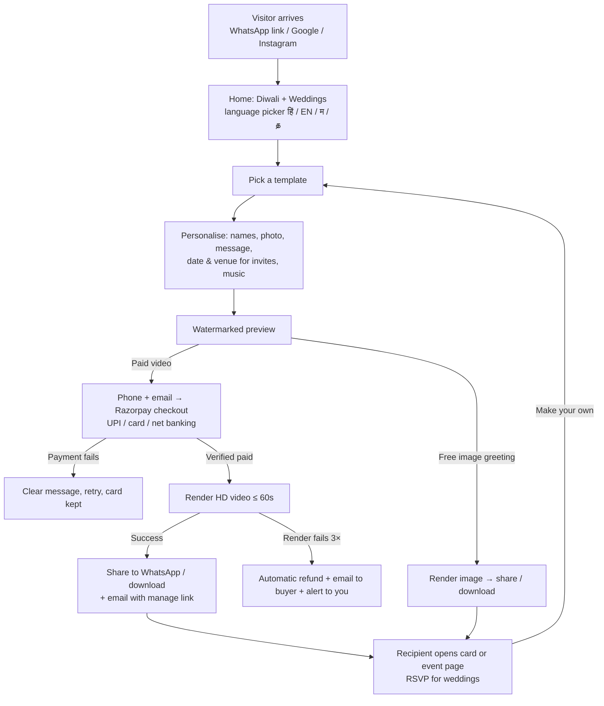

# 09 — Lean Launch Plan (solo founder + Claude, go live in ~2 weeks)

**Status:** Draft v1 · **As of:** 2 October 2026 · **Supersedes** the timeline, team and budget in `08-roadmap-team-cost-gtm.md` for the first launch. The full PRD (`02`–`07`) stays the long-term target. This document is the **bare minimum version** we ship first.

Labels: **[V]** sourced · **[E]** estimate · **[A]** assumption.

---

## 1. What changed and why

| Founder input | What it means for the plan |
|---|---|
| Go live after 1–2 weeks of build + testing | Target go-live **Fri 16 Oct 2026**, before Dussehra (20 Oct) and three weeks before **Diwali (8 Nov)** **[V]**. The Nov–Dec wedding season follows. |
| Solo founder; Claude does the development | No team payroll. Managed services only. Claude also writes the templates as code. You handle accounts, KYC, testing on phones, and marketing. |
| Video invitations for Diwali and weddings | Launch catalogue = Diwali greetings (free images, paid videos) + Diwali puja/party video invites + wedding video invites. |
| Start slow on budget | About **₹6–7k a month** of fixed cost; no ads needed to launch (₹10–20k optional for Diwali). |

**Why the PRD's validation pilot is no longer separate:** launching now *is* the pilot. Diwali 2026 tests whether people pay, and the wedding season tests invitations, on the real product.

---

## 2. Scope: what's in at go-live

| Area | In at go-live | Deferred (from the PRD) |
|---|---|---|
| Catalogue | Diwali collection (Dhanteras, Diwali, Bhai Dooj), Diwali puja/party invites, wedding invites | Other festivals (added each week after launch), birthdays, Good Morning |
| Languages | Hindi, English, Marathi, Tamil: UI + template text. Claude translates; **a native speaker reviews Marathi and Tamil** | More languages |
| Editor | Guided slots: names, photo, message, date/time/venue (invites), music choice, language | Background removal, transliteration, AI wish writer (replaced by **ready-written wishes per language**) |
| Output | Image (free, small logo) and video (paid, HD, no watermark); watermarked preview before paying | Multiple formats beyond Status 9:16 and Square |
| Sharing | WhatsApp file share, link share, download; **recipient page with "Make your own"** | Replies ("send wishes back") |
| Invitations | Event page (details, map link, add to calendar) + simple RSVP for the wedding Premium tier | RSVP export, multi-event bundles |
| Accounts | **No login.** Buyer gives phone + email at checkout. A private "manage" link is emailed for re-download and edits | OTP login, My Cards dashboard |
| Payments | Razorpay hosted checkout (UPI intent/QR, cards, net banking), verified webhooks, **automatic refund if the render fails**, emailed receipt | Coupons, referrals, Pass, Business Plan, second gateway |
| Ops | Log tables (orders, payments, webhooks, renders, refunds, errors); **email alerts to you** for payment failures, refund failures and render failures; PostHog analytics; Sentry errors | Grafana dashboards, PagerDuty, daily reconciliation report (in week 3) |
| Admin | Templates are added in code by Claude; orders and refunds are viewed in the Supabase and Razorpay dashboards | Admin CMS |
| Honest pricing | "Diwali launch price" label; **no strike-through until a price has actually been charged** for 30 days; badges are "New" and "Diwali special" only, until real sales data exists | Data-driven Bestseller/Trending badges (switched on once there are ≥ 25 orders in 7 days) |

---

## 3. User flow (go-live)

---

## 4. Lean tech stack

| Need | Choice | Monthly cost **[E]** | Why |
|---|---|---|---|
| Website (Next.js, 4 languages, SEO) | **Vercel Pro** | ~₹1,800 ($20) | Fastest to ship and deploy; commercial use needs the Pro plan |
| Database + file storage for uploads | **Supabase Pro**, Mumbai region | ~₹2,200 ($25) | Postgres + storage + daily backups in one service, hosted in India |
| Video render worker (FFmpeg + headless Chromium) | **DigitalOcean droplet in Bangalore**, 2 vCPU / 4 GB | ~₹2,100 ($24); bump to 4 vCPU for Diwali week (+~₹1,000 prorated) | Renders 200–300 videos an hour **[E]**; jobs queue in Postgres |
| Rendered videos/images delivery | **Cloudflare R2** + Cloudflare DNS/CDN/WAF (free plan) | ₹0–500 | Zero egress fees; DDoS protection |
| Payments | **Razorpay** | ₹0 fixed; ~2% per payment + 18% GST on the fee **[V]** | Best docs, UPI intent, refund API, quick onboarding |
| Email (receipts, alerts) | **Resend** (free tier 3,000/month) | ₹0 | Simple API |
| Analytics / errors | **PostHog** + **Sentry** (free tiers) | ₹0 | Funnels and error tracking from day 1 |
| Domain (.com + .in) | Any registrar | ~₹2,500/year | — |
| Business email (support@yourbrand) | Zoho Mail | ₹0–₹60 | Needed for Razorpay and trust |
| **Total fixed** | | **≈ ₹6,000–7,000/month** | |

**Video templates are built as code:** each template is an HTML/CSS/SVG animation with slots. The worker opens it in headless Chromium (which shapes Hindi, Marathi and Tamil text correctly), captures the frames, and encodes an MP4 with FFmpeg, adding the music. Claude can author these templates. Quality will be clean and modern, but not at the level of a professional motion designer. Once revenue comes in, buy or commission 3–5 hero templates.

---

## 5. Pricing at launch

Unregistered for GST at launch (see §7), so these are the full prices.

| Product | Price | What you get |
|---|---|---|
| Diwali image greeting | **Free** | Name + photo, small corner logo, share/download |
| Diwali video greeting (15–20s, music) | **₹29** (Diwali launch price) | HD, no watermark, 3 edits within 7 days |
| Diwali puja / party video invitation | **₹99** | 20–30s video + event page with map and add-to-calendar |
| Wedding video invitation: Standard | **₹199** | 30–40s, 2 photos, 1 language |
| Wedding video invitation: **Premium (Recommended)** | **₹399** | 45–60s, up to 6 photos, event page + RSVP, unlimited edits for 14 days |

**Unit economics per sale [E]:**

| Sale | Gateway fee | Render + delivery | You keep |
|---|---|---|---|
| ₹29 video greeting | ~₹0.70 | ~₹0.20 | ≈ ₹28 |
| ₹399 wedding invite | ~₹9.40 | ~₹1 | ≈ ₹388 |

**Break-even on fixed costs:** about **17 Premium wedding invites** or **230 Diwali videos** a month.

**About the discount display you wanted:** India's 2023 rules on dark patterns (from the consumer protection authority, CCPA) make a strike-through "MRP" that was never charged illegal. At launch we use **"Diwali launch price"** and **"Recommended"** labels instead. Real strike-through prices and "Bestseller" badges switch on automatically once there's genuine price history and sales data.

---

## 6. Two-week schedule

| Days | Claude builds | You do |
|---|---|---|
| **1** (Fri 2 Oct – Sat 3 Oct) | Project setup; a **live landing page with Terms, Privacy, Refund policy, Pricing and Contact pages** (Razorpay checks these during KYC) | Buy the domain; create the accounts (§7); **apply for Razorpay with KYC today** |
| 2–5 | Catalogue, 4-language UI, editor, watermarked preview, render worker (image + video), uploads | Find 1 Marathi and 1 Tamil reviewer (friends/family); collect sample photos for testing |
| 6–8 | Razorpay checkout + webhooks + automatic refunds; receipt emails with the manage link; recipient and event pages; RSVP; log tables; email alerts | Review the policy texts; set up support@ email |
| 9–11 | Templates: 12 Diwali images, 6 Diwali videos, 3 Diwali invites, 6 wedding invites (Hindi / Marathi / Tamil / modern English styles), ready-written wishes in 4 languages | Native-speaker review; pick the music tracks (licence check) |
| 12–13 | Fixes; security checklist; light load test | **Test on real phones**: a cheap Android phone, an iPhone, inside WhatsApp; test payments in test mode, including a failed payment and a refund |
| **14** (~Fri 16 Oct) | Switch to Razorpay live keys; Search Console + sitemap; launch-day monitoring | Soft launch to family and friends + WhatsApp groups; Instagram posts |

**Critical path:** **Razorpay KYC approval** (usually a few working days **[A]**). If it isn't approved by launch day, we go live with free greetings and turn on paid videos the day it clears.

---

## 7. Bare-minimum go-live checklist (what you provide)

### Must have
- [ ] **PAN + a bank account** in your name (individual/proprietorship is fine to start)
- [ ] **Razorpay account** with KYC submitted on Day 1 (they'll check that the website and policy pages are live)
- [ ] **Domain name** (.com and .in if you can)
- [ ] **Business email** (support@yourdomain) and a **contact phone number** shown on the site, as the consumer e-commerce rules require
- [ ] **Accounts** (free to create; Claude will guide you): GitHub, Vercel, Supabase, Cloudflare, DigitalOcean, Resend, PostHog, Sentry, Google Search Console
- [ ] **API keys entered by you** into Vercel/Supabase settings. Never paste secrets into chat
- [ ] **Native-speaker reviewers** for Marathi and Tamil (a few hours each)
- [ ] **Music**: 5–8 tracks with a licence that allows use inside videos you sell (royalty-free packs; ₹0–5,000)
- [ ] **Test devices**: one low-end Android phone + WhatsApp; an iPhone if possible
- [ ] **Grievance contact** (can be you) named on the site

### Not needed on day 1
- **GST registration:** service providers under ₹20 lakh annual turnover generally don't need to register, even when selling across states **[A: confirm with a CA]**. Register once you get close to that.
- A company or LLP (start as an individual; incorporate later).
- A lawyer (Claude drafts the policies; an optional ₹5–15k review later).
- Trademark registration (file once the name is final; ~₹4,500 for an individual filing in one class **[A]**).

---

## 8. Brand name

**Recommendation: Toran** (तोरण · தோரணம்)
- **Why it works:** a toran is the auspicious decorated door-hanging put up for **both festivals and weddings**, exactly our two collections.
- **Pan-Indian:** the same word in Hindi and Marathi (तोरण), and *thoranam* (தோரணம்) in Tamil, so one name works in all four languages.
- **Easy to say and spell:** short, two syllables, easy in English and Devanagari, and memorable.
- **Open in this category:** searches didn't find an e-card or invitation product called Toran (unlike "Shubh Cards", which is an established Chennai invitation printer with shubhcards.com, and "Nimantran", which is crowded).
- **Domain suggestions:** `toran.cards`, `torancards.in` / `torancards.com`, `gettoran.com`, `toran.app`. Adding "cards" gives a light keyword signal.

**Backups:**
- **Rangoli Cards:** festive and universal, but "rangoli" is generic, so it's harder to own in search and to trademark.
- **Utsavam:** "festival" in Tamil/Telugu (Hindi *utsav*); pan-Indian, but many "Utsav" brands already exist.

**The truth about SEO and names:** an exact-match domain gives little ranking benefit today. Rankings come from **per-language festival pages** (e.g. "Diwali wishes in Marathi"), page speed and backlinks, and the plan builds those. The name matters for **memorability, trust and click-through on WhatsApp previews**.

**Before you buy:** domain availability and trademarks could not be checked from this environment.
1. Check the domain on a registrar.
2. Run a **trademark search** on the IP India public search (classes 9, 35, 42).

---

## 9. Costs summary

| | Amount **[E]** |
|---|---|
| One-time to launch | ₹3–8k (domain, music, test-phone data) |
| Fixed monthly | ₹6–7k |
| Diwali-week server bump | ~₹1k |
| Per sale | ~2.4% gateway fee (incl. GST on the fee) + < ₹1 render |
| Optional Diwali promotion | ₹10–20k (Instagram/Facebook boosts in Hindi/Marathi/Tamil) |
| Your Claude subscription | Separate (whatever plan you're on) |

**Scale-up path:** stay on this stack up to roughly 50–100k monthly users. Then move step by step to the PRD architecture (`04-system-design.md`): queue-based worker autoscaling, OTP accounts, an admin CMS and a second gateway. Most of the code carries over.

---

## 10. Risks of the lean approach

| Risk | Mitigation |
|---|---|
| Razorpay KYC is delayed | Apply on Day 1; launch free greetings first if needed |
| Template quality from code-built designs | Strong typography and colour; buy 3–5 hero templates from first revenue |
| One render server becomes a bottleneck on Diwali day | Queue with "we'll email you when it's ready"; resize the droplet the week before; free images render separately |
| Marathi/Tamil quality | Native review is mandatory before those templates go live |
| Support load on a single person | Clear FAQ, automatic refunds, a WhatsApp Business auto-reply |
